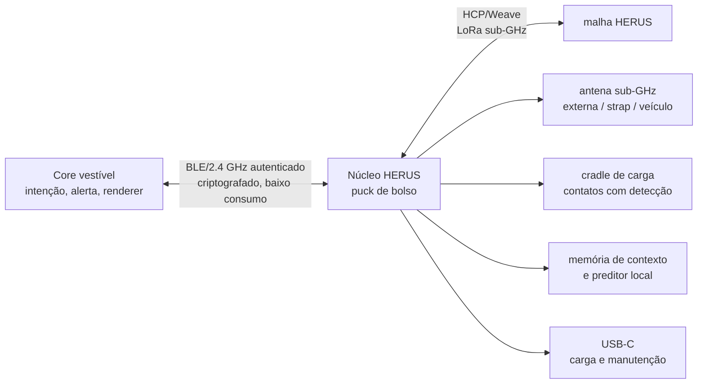

# NÚCLEO HERUS — puck de bolso, estação-base pessoal e computação local

**Revisão 0.1 · arquitetura de produto e firmware · pré-hardware**

> O vestível é o objeto íntimo: pequeno, silencioso e sempre com a pessoa. O **Núcleo** é o objeto capaz: fica no bolso, na mochila ou na mesa, leva a antena que o pulso não comporta, armazena energia, carrega o vestível e torna explícita a inteligência que deve ficar local.

O Núcleo HERUS é um puck circular de bolso que amplia o sistema HERUS sem exigir nuvem, conta, telefone ou microfone sempre ativo. Ele cumpre quatro funções: **rádio de longo alcance**, **base móvel**, **carregador do vestível** e **nó de computação local**. Ele não é um roteador que pode ler tudo, nem um assistente conversacional, nem uma promessa de IA genérica. É uma máquina de contexto limitado que aprende rotinas consentidas, explica cada sugestão e nunca transmite uma inferência sem confirmação humana.

## 1. A decisão de produto

O wearable de pulso tem um conflito físico incontornável: a antena fica próxima ao corpo, a altura é baixa, a bateria é pequena e o volume disponível compete com transdutor, vedação e carregamento. O Núcleo remove esses conflitos do item que fica no corpo. O resultado é um sistema com dois objetos deliberadamente diferentes.

| Elemento | Core vestível | Núcleo HERUS |
|---|---|---|
| Lugar natural | Pulso, lapela ou roupa | Bolso, mochila, janela, mesa ou veículo |
| Trabalho principal | Capturar intenção, alertar e renderizar | Retransmitir, manter contexto, carregar e ampliar alcance |
| Rádio externo | Antena discreta, baixo ganho | SX1262 com antena externa sintonizada e ground plane útil |
| Energia | Autonomia e baixo consumo | Bateria maior, USB-C, charging cradle e orçamento de relay |
| Inteligência | Seleção simples e confirmação | Memória associativa local, predição explicável e governança de enlace |
| Privacidade | Chaves e interação pessoal | Dados somente de pares autorizados, em repouso cifrados; relay cego por padrão |

A regra central é: **o Núcleo melhora o sistema, mas não se torna um ponto obrigatório de falha**. Se ele descarregar, ficar fora de alcance ou for perdido, o wearable continua sendo um comunicador HERUS completo. Se ele estiver próximo, o wearable ganha antena, carga, uma base de relay e computação mais rica.

## 2. Arquitetura de referência



A referência de implementação é um **ESP32-S3 com PSRAM** no Núcleo, para acelerar a computação vetorial e manter uma memória de contexto suficiente, acoplado a um **SX1262** para o rádio sub-GHz. O SX1262 oferece LoRa e até +22 dBm de potência de transmissão; o desenho final deve, porém, impor EIRP, duty cycle, região e limites de exposição por meio de perfis de hardware bloqueados em firmware. [1]

A versão seguinte do vestível deve migrar para um controlador de baixo consumo da classe **nRF54L15**, usando BLE ou protocolo proprietário de 2,4 GHz exclusivamente como enlace Core↔Núcleo. A ficha do componente declara 1,5 MB de NVM, 256 KB de RAM e modos de sono entre 0,7 e 2,9 µA; ele é adequado para esse papel, mas a troca de silício permanece uma decisão de PCB, não uma dependência do protótipo inicial. [2]

| Bloco do Núcleo | Referência | Regra de implementação |
|---|---|---|
| Computação | ESP32-S3 N16R8 ou equivalente | Processa apenas dados explicitamente autorizados; nenhuma dependência de servidor. |
| Rádio externo | SX1262 + filtro/matching por região | Antena destacável ou integrada ao case; potência configurada por perfil regional bloqueado. |
| Enlace ao Core | BLE autenticado ou 2,4 GHz proprietário | Sessão rotacionada; sem pareamento implícito; SAS para primeira associação off-grid; envelope de controle AEAD com sequência e expiração. |
| Energia | LiPo/Li-ion de 2–3 Ah, BMS, medição coulomb | Bateria, temperatura e corrente são telemetria local; não fingir autonomia antes de medição. |
| Carregamento | USB-C 5 V inicial, cradle com pinos magnéticos polarizados | O cradle identifica o Core antes de habilitar carga; limites térmicos e FOD são critérios de hardware. |
| Armazenamento | Flash cifrada + contador monotônico/secure element na revisão de produto | Contexto, chaves e logs de manutenção têm políticas de retenção e apagamento. |
| Interface | LED discretos, haptic/buzzer e botão físico | Toda ação que transmite ou autoriza localização exige indicação física clara. |

## 3. Dois planos de dados, uma regra de privacidade

O Núcleo possui dois planos que não podem ser confundidos. O primeiro é o **plano de relay**: recebe um frame HERUS já cifrado e o retransmite via Weave sem inspecionar seu significado. Esse caminho deve continuar cego, inclusive quando o puck estiver em modo Anchor ou ligado à internet no futuro. O segundo é o **plano de companheiro**: recebe do Core, por um enlace autenticado, uma cópia explícita de mensagens e preferências que o dono autorizou para contexto local. Ele existe para sugestões, não para vigilância.

| Dado | Relay cego | Companheiro autorizado |
|---|---|---|
| Frame de outro membro da malha | Encaminha sem decriptar | Não armazena nem analisa |
| Mensagem criada pelo dono | Encaminha o ciphertext | Pode aprender uma transição semântica local se a coleta estiver ativada |
| RSSI, SNR, PDR, bateria e fila | Usa para governar enlace | Usa para recomendação de perfil e diagnóstico |
| Localização | Nunca anuncia por inferência | Só usa quando o dono ativa o recurso e confirma transmissão |
| Áudio bruto | Nunca recebe | Nunca guarda; o sistema trabalha sobre símbolos já decididos |

A separação resolve a tensão entre “mais inteligente” e “mais privado”. A inteligência do Núcleo é opt-in, local e limitada a significados que o proprietário escolhe fornecer. A malha continua com as propriedades de confidencialidade e de endereços efêmeros do protocolo HCP.

## 4. A inteligência que o Núcleo deve ter

A inteligência do Núcleo não é um modelo de linguagem. Ela é uma **memória associativa semântica com regras de decisão verificáveis**. O firmware `nucleus.[ch]` introduz quatro capacidades locais e mensuráveis:

1. **Rotinas e sugestões de intenção.** O Núcleo observa transições entre mensagens HCP autorizadas e aprende, por pares, qual mensagem composta costuma seguir um contexto recente. Ele só sugere um modelo já observado várias vezes e apresenta a confiança calculada a partir de suporte/observações.
2. **Compressão de interação, não de segurança.** Uma sugestão aceita preenche uma mensagem HCP normal; nada sobre a estrutura do frame, a criptografia ou o airtime muda. O sistema reduz toques, não reduz a proteção nem cria um canal paralelo.
3. **Governador de enlace.** A partir de RSSI, SNR, PDR, fila, bateria e presença do Core, o Núcleo recomenda perfil Rich ou Reach na hora de provisionar um grupo, aciona relay somente dentro de limites de energia e produz diagnóstico de “aproxime o puck da janela” em vez de inventar alcance.
4. **Memória com vencimento.** Toda regra tem TTL, contador de observações e limite rígido de capacidade. Regras velhas ou fracas são removidas; não existe diário infinito escondido no bolso.

A decisão é propositalmente conservadora. O Núcleo **nunca transmite uma previsão**, nunca transforma um palpite em SOS, nunca altera endereço/TTL/AEAD e nunca permite que uma inferência crie uma mensagem sem botão físico ou confirmação equivalente.

## 5. Contrato do firmware

O módulo de inteligência tem uma área de memória fixa e sem alocação dinâmica. Isso permite exercitar todos os limites em host antes de introduzir rádio ou sistema operacional. Sua API recebe `hcp_msg_t` já autorizado, mantém um histórico mínimo e retorna no máximo três sugestões ordenadas por confiança. O mesmo módulo inclui um governador de base móvel que transforma telemetria local em recomendações de posicionamento, relay e carga; ele não pode transmitir, trocar o perfil de um grupo, nem atuar o carregador.

```bash
cd firmware && make nucleus
```

A suíte executa cenários de consentimento, confiança, expiração, apagamento, perda de enlace, bateria baixa e entrega degradada. O resultado esperado é `NUCLEUS INVARIANTS HOLD`; qualquer saída diferente bloqueia `./prove.sh`.

| Invariante | O que impede |
|---|---|
| `NUC_RULE_CAP` fixo | Crescimento de RAM ou banco de dados sem limite |
| Uma regra só aprende mensagem válida | Corrupção ou entrada parcial virarem conhecimento |
| Confiança exige suporte mínimo | Uma única coincidência virar automação |
| Rejeição de observações próprias como destino | Loop de auto-sugestão |
| TTL e envelhecimento obrigatório | Preferências antigas sobreviverem indefinidamente |
| Consulta não muta estado | “Prever” não pode alterar o que foi aprendido |
| Sem I/O no módulo | A inteligência não abre caminho de rádio, rede ou áudio oculto |

## 6. Envelope físico de prototipagem

A geometria de referência inicial é um cilindro de **70–75 mm de diâmetro e 16–20 mm de altura**, deliberadamente maior que um smartwatch e pequeno o suficiente para bolso. A meta de massa, autonomia e aquecimento não é declarada como fato até que a primeira unidade tenha medição de corrente e ensaio térmico. A forma circular favorece bateria plana, bobina/carregamento opcional, antena periférica e uma base estável para o Core; não resolve por si só eficiência da antena nem certificação.

A Fase Núcleo-0 começa com uma caixa impressa, um devkit ESP32-S3, uma placa SX1262 com conector de antena, uma célula protegida e um medidor de corrente. Não há PCB próprio antes de três números existirem: PDR no corpo em rota urbana, energia por frame/relay e temperatura no carregamento.

## 7. Critérios de interrupção

| Experimento | Critério de falha | Decisão honesta |
|---|---|---|
| Core↔Núcleo no bolso | PDR inferior a 99% em 5 m de uso corporal normal | Mudar posição, protocolo/antena de 2,4 GHz ou usar fio/cradle; não mascarar com retransmissão. |
| Núcleo↔Núcleo/Anchor em rota urbana | Não superar materialmente o Core no pulso na mesma potência permitida | Rever antena/altura e o papel do puck; não vender “longo alcance”. |
| Relay energético | Custo diário exceder a bateria planejada no perfil real de uso | Reduzir janela de escuta, impor orçamento ou retirar o papel de relay móvel. |
| Carga de Core | Temperatura, alinhamento ou desgaste de pinos falhar em ciclos iniciais | Simplificar para USB-C/contato robusto antes de miniaturizar. |
| Sugestões semânticas | Menos de 70% das sugestões com confiança alta são aceitas no piloto | Tratar a função como experimento, reduzir escopo ou removê-la. |
| Privacidade | Não é possível apagar contexto e provar que relay não o lê | Não habilitar inteligência ao usuário. |

## 8. Ordem de execução

O próximo protótipo deve provar o rádio e a base, não o acabamento. A sequência correta é: corrigir a prova host; integrar a memória associativa com testes; demonstrar Core→Núcleo→malha com ciphertext opaco; aplicar o contrato de controle autenticado do [Avanço 6](12-ENLACE-CORE-NUCLEO.md); medir o enlace no bolso; medir relay e carregamento; apenas então desenhar PCB e enclosure final.

A meta final não é colocar “IA” no puck. É fazer com que uma pessoa em uma equipe opere com menos ambiguidade, mais alcance prático e menos dependência de infraestrutura, mantendo o significado e as chaves sob seu próprio controle.

## Referências

[1] [Semtech SX1262 — LoRa Connect Transceiver](https://www.semtech.com/products/wireless-rf/lora-connect/sx1262)
[2] [Nordic Semiconductor nRF54L15 — Ultra-low-power wireless SoC](https://www.nordicsemi.com/Products/nRF54L15)
