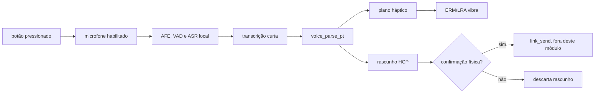

# 07 — Voz controlada e resposta háptica

**Avanço 1 de 10 · Revisão 0.1 · contrato de interação local**

> O HERUS deve ouvir uma pessoa, não vigiar uma pessoa. Por isso, o caminho de voz começa em um botão físico e termina em uma confirmação física. Entre os dois pontos, áudio nunca entra no rádio, não há conta, não há nuvem e uma interpretação nunca vira transmissão sozinha.

Este avanço implementa uma camada portátil de **interpretação de linguagem natural controlada** e um planejador de resposta por vibração. Ela recebe uma transcrição curta gerada localmente, reconhece intenções de um vocabulário configurável, produz um rascunho HCP e devolve um padrão háptico limitado. Ela não é um modelo de linguagem de domínio aberto e não declara conversação livre como capacidade. Essa limitação é uma propriedade de segurança, energia, memória e experiência do usuário.

## 1. Caminho de interação



O adaptador de áudio pretendido para o protótipo ESP32-S3 é o ESP-SR/MultiNet. A Espressif documenta reconhecimento de comandos offline, personalização de comandos e até 200 comandos no ESP32-S3, mas esse componente não é ligado pelo módulo portátil desta revisão. [1] O firmware `voice.[ch]` recebe somente a frase já reconhecida; desse modo, parser, semântica e háptica são verificáveis em host antes da integração de microfone.

| Etapa | O que faz | O que não pode fazer |
|---|---|---|
| Botão de fala | Autoriza uma única janela de áudio | Ligar microfone permanente ou wake word oculto |
| ASR local | Converte uma frase curta em texto local | Enviar áudio, texto ou embeddings à rede |
| Parser controlado | Converte frase em intenção HCP configurável | Enviar frame, alterar chaves, inventar intenção desconhecida |
| Plano háptico | Descreve pulsos de vibração curtos | Acionar motor diretamente ou substituir confirmação |
| Aplicação/HAL | Mostra ou vibra e coleta confirmação | Ignorar limites térmicos, corrente ou presença humana |
| Link HERUS | Apenas após confirmação, sela e transmite | Receber rascunho como autorização de envio |

## 2. Linguagem inicial em português

A primeira gramática é deliberadamente pequena, porém útil. Ela admite variações simples de fala cotidiana e preenche apenas campos que o léxico local autorizou. Os identificadores de intenção e papel são configuração de domínio, não uma lista universal embutida no protocolo.

| Exemplo de frase | Resultado semântico | Confirmação | Vibração |
|---|---|---:|---|
| “chego em dez minutos” | `ARRIVE` + `time=10 min` | obrigatória | dois pulsos curtos |
| “estou chegando” | `ARRIVE` | obrigatória | dois pulsos curtos |
| “preciso de ajuda” / “socorro” | `HELP` privado, **não SOS público** | confirmação crítica obrigatória | longo–curto–longo |
| “cancelar” | descarta somente o rascunho local | não transmite | um pulso longo |
| frase fora do léxico | nenhuma intenção | não transmite | três pulsos curtos |

Números por extenso até sessenta minutos, incluindo composições como “vinte e cinco”, são convertidos em um filler configurável de tempo. A implementação também aceita algarismos quando a fonte de transcrição os entrega, sem depender deles como palavra de comando. Frases ambíguas, duração fora da faixa e comandos sem intenção reconhecida são rejeitados e não geram HCP.

## 3. Contrato de segurança

| Invariante | Consequência executável |
|---|---|
| Voz só entra depois de um evento físico externo | O parser não inicializa microfone, VAD ou ASR |
| Não há Tier SOS por reconhecimento de fala | “socorro” gera apenas rascunho `HELP` privado e confirmação crítica |
| Um rascunho não tem `seq`, `ttl` ou `prio` de transporte | Aplicação deve preencher esses campos depois da confirmação |
| Parser não depende de `link_send` nem de chaves | Não há caminho acidental de transmissão |
| Padrão háptico tem número, duração e tempo total limitados | Uma falha de parser não pode prender o atuador ligado |
| Transcrição desconhecida não produz intenção | Ruído, ASR incerto ou fala fora da gramática falham fechados |
| Léxico é injetado pelo domínio | Uma linguagem de equipe não altera o protocolo HCP |

A resposta háptica é descrita em pulsos abstratos (`on_ms`, `off_ms`), não em registros de um chip específico. Um driver posterior pode traduzir o plano para ERM ou LRA; o DRV2605L é uma opção de referência por suportar atuadores ERM/LRA, biblioteca de efeitos e rastreamento de ressonância. [2] O driver elétrico continua responsável por corrente, temperatura, ressonância e corte seguro.

## 4. API portátil

```c
voice_status_t voice_parse_pt(const char *transcript,
                              const voice_lexicon_t *lexicon,
                              voice_result_t *out);
```

`voice_parse_pt` aceita texto UTF-8 curto, normaliza acentos portugueses, limita a frase a 96 bytes e devolve uma de quatro saídas: `VOICE_DRAFT`, `VOICE_CANCEL_LOCAL`, `VOICE_UNKNOWN` ou `VOICE_REJECTED`. Um `VOICE_DRAFT` sempre contém `requires_confirmation=1`. O chamador deve exibir/renderizar o rascunho, aguardar botão ou gesto de confirmação, preencher sequência/TTL/prioridade e somente então chamar a camada de enlace.

```c
void voice_haptic_plan(voice_event_t event, haptic_plan_t *out);
```

A função devolve no máximo cinco pulsos, cada um limitado a 200 ms e com tempo total limitado a 1,5 s. Não contém I/O, temporizadores, GPIO nem dependência de driver. Essa separação faz com que o mesmo contrato rode em host, ESP32-S3, nRF54 ou no Núcleo.

## 5. Prova e integração de hardware

```bash
cd firmware && make voice
```

A suíte verifica que a frase de chegada preenche tempo e exige confirmação; que pedidos de ajuda nunca viram SOS; que cancelamento permanece local; que ruído/entrada desconhecida falha fechada; que transporte é zerado; e que os planos hápticos respeitam todos os limites. `./prove.sh` integra o resultado como invariável de voz e háptica.

A primeira integração no Core deve usar microfone com botão físico, AFE/VAD local, ESP-SR/MultiNet, o módulo `voice.[ch]`, uma rotina de confirmação e um driver háptico. O teste de aceitação não é “ele entende qualquer frase”; é: em ambiente ruidoso representativo, o sistema só pode sugerir intenções autorizadas, nunca pode transmitir sem confirmação e o usuário deve distinguir os padrões de vibração antes de depender deles.

## Referências

[1] [Espressif ESP-SR — MultiNet Command Word Recognition Model](https://docs.espressif.com/projects/esp-sr/en/latest/esp32s3/speech_command_recognition/README.html)
[2] [Texas Instruments DRV2605L — Haptic driver for ERM/LRA](https://www.ti.com/product/DRV2605L)
