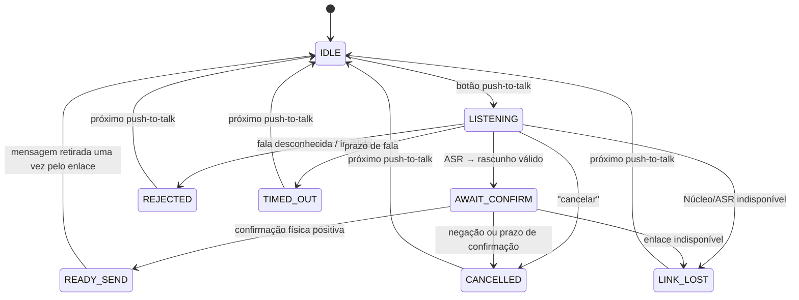

# 08 — Runtime seguro de interação Core↔Núcleo

**Avanço 2 de 10 · Revisão 0.1 · máquina de estados portátil**

> O reconhecimento de voz pode errar; uma máquina de estados não deve errar sobre o que está autorizado a transmitir. O runtime é a fronteira que converte eventos de botão, ASR e confirmação em um único rascunho HCP liberado, ou em descarte seguro.

Este avanço transforma o contrato de voz/háptica do Avanço 1 em um fluxo operacional testável. O módulo `interaction.[ch]` não contém driver de microfone, ASR, rádio, haptics, armazenamento, criptografia nem timers de sistema. Ele recebe eventos de adaptadores e emite ações para adaptadores. Essa separação permite rodar o mesmo código no host, no Core e no Núcleo.

## 1. Máquina de estados



| Estado | Microfone/ASR | Rascunho HCP | Envio permitido | Resposta esperada |
|---|---|---|---|---|
| `IDLE` | Desligado | Nenhum | Não | Nenhuma |
| `LISTENING` | Habilitado por botão e com prazo | Nenhum | Não | Nenhuma |
| `AWAIT_CONFIRM` | Desligado | Válido, mas privado | Não | Padrão de vibração + exibição/renderização |
| `READY_SEND` | Desligado | Válido e confirmado | Uma retirada | Confirmação ao aplicativo; o enlace ainda sela e aplica regras regionais |
| `CANCELLED`, `REJECTED`, `TIMED_OUT`, `LINK_LOST` | Desligado | Apagado | Não | Vibração de cancelamento/erro e retorno a `IDLE` no próximo botão |

A palavra de ajuda é deliberadamente um rascunho `HELP` privado e crítico. Ela continua exigindo confirmação e **não** pode transicionar diretamente para SOS público. SOS permanece uma ação diferente, com seu próprio botão/UX e assinatura de hardware.

## 2. Fronteira entre Core, Núcleo e adaptadores

O Core continua resiliente e não depende do puck para rádio básico. Quando o Núcleo está disponível, ele pode hospedar a pilha de áudio mais dispendiosa — AFE, VAD e MultiNet — e devolver apenas uma transcrição local. O runtime não sabe onde ocorreu o ASR; ele só recebe uma transcrição após um botão de fala.

| Camada | Responsabilidade | Não pode fazer |
|---|---|---|
| Core | Botão, feedback, interação e rádio HERUS resiliente | Escuta permanente ou envio por interpretação |
| Núcleo | Energia, AFE/VAD/ASR local e contexto opcional | Enviar áudio, atuar como relay que lê terceiros ou confirmar pelo usuário |
| `interaction.[ch]` | Estado, prazo, rascunho, autorização de retirada e telemetria | I/O, envio de quadro, acesso a chave ou ligação a um SDK de ASR |
| Adaptador ESP-SR | Captura com botão, AFE/VAD e transcrição local | Decidir significado HCP ou liberar transmissão |
| Aplicativo/link | Renderizar, confirmar, preencher transporte e chamar `link_send` | Ignorar `READY_SEND` ou reutilizar um rascunho já retirado |
| Driver háptico | Aplicar plano de pulsos dentro de limites elétricos/térmicos | Alterar estado de interação ou servir como confirmação |

A separação segue a organização do ESP-SR: o framework expõe AFE, WakeNet, VADNet e MultiNet como módulos distintos. [1] No HERUS, o AFE/VAD somente prepara uma janela que já foi autorizada pelo botão; WakeNet permanece fora da configuração de produção porque a privacidade e a energia proíbem microfone sempre ativo. A documentação do AFE declara saída de estado de atividade de voz por frame, útil para encerrar uma janela de fala iniciada por botão. [2]

## 3. API e telemetria

```c
int interaction_push_to_talk(interaction_t *it, uint32_t now_ms);
int interaction_transcript(interaction_t *it, const char *text, uint32_t now_ms);
int interaction_confirm(interaction_t *it, int accepted, uint32_t now_ms);
int interaction_take_send(interaction_t *it, hcp_msg_t *out);
int interaction_tick(interaction_t *it, uint32_t now_ms);
```

A API retorna ações declarativas: iniciar/parar captura, apresentar/limpar rascunho e reproduzir um plano háptico. Um adaptador aplica essas ações e informa o próximo evento. Dessa forma, uma simulação pode provar o fluxo sem GPIO e o ESP32-S3 pode integrar ESP-SR sem contaminar a lógica portável.

| Métrica | Origem | Uso permitido |
|---|---|---|
| Sessões push-to-talk e rascunhos | Runtime | Testar adoção e taxa de compreensão, localmente |
| Rejeições, cancelamentos, timeout e perda de enlace | Runtime | Refinar UX e critérios de hardware |
| Latência botão→transcrição | Timestamp monotônico do adaptador | Escolher Core ou Núcleo como processador de ASR |
| Energia por interação | Medidor físico/PMIC informado pelo adaptador | Orçamento real; o runtime não estima por tensão |
| Transcrição ou áudio bruto | **Não é telemetria** | Nunca persiste no runtime |

## 4. Invariantes do Avanço 2

| Invariante | Prova |
|---|---|
| Nenhum envio antes de confirmação | `interaction_take_send()` falha fora de `READY_SEND` |
| Cada confirmação libera no máximo uma mensagem | retirada muda imediatamente o estado para `IDLE` |
| Timeout e perda de enlace apagam o rascunho | testes de transição verificam `nslot=0` e intenção zerada |
| Cancelar nunca chama o caminho de envio | resposta é local e `READY_SEND` nunca é atingido |
| Pedido falado de ajuda não vira SOS | parser + runtime preservam tier não-SOS e exigem confirmação |
| ASR somente existe após push-to-talk | `LISTENING` é atingido somente por `interaction_push_to_talk()` |
| Planos hápticos seguem os limites do Avanço 1 | runtime reutiliza `voice_haptic_plan` e `haptic_plan_safe` |
| Telemetria não guarda fala | somente contadores, latência agregada e energia medida são aceitos |

## 5. Integração ESP32-S3 futura

O adaptador de ESP-SR será uma camada de porta, não parte de `interaction.[ch]`. Ao receber `start_capture`, ele inicializa o AFE, habilita uma sessão curta de VAD/MultiNet e entrega uma transcrição; ao receber `stop_capture`, encerra e limpa buffers. O modelo MultiNet é offline e permite comandos customizados, mas o produto continua limitado a uma linguagem controlada configurada pelo léxico HERUS. [3]

A aceitação em hardware exige quatro medidas publicadas: taxa de falsos rascunhos em ruído representativo, tempo botão→vibração, energia por sessão e porcentagem de usuários que distinguem os padrões hápticos. O runtime atual cria os pontos de medição; não alegará esses números antes de uma bancada real.

## Referências

[1] [Espressif ESP-SR — módulos do framework](https://github.com/espressif/esp-sr)
[2] [Espressif ESP-SR — Audio Front-end Framework](https://docs.espressif.com/projects/esp-sr/en/latest/esp32s3/audio_front_end/README.html)
[3] [Espressif ESP-SR — MultiNet Command Word Recognition](https://docs.espressif.com/projects/esp-sr/en/latest/esp32s3/speech_command_recognition/README.html)
