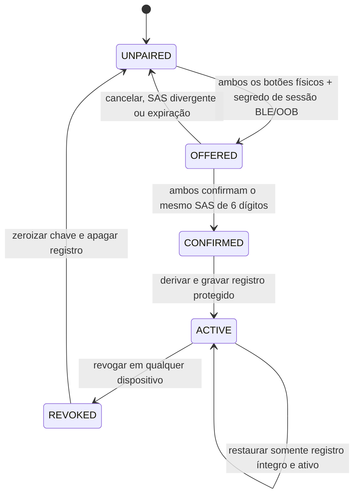

# 13 — Ciclo de confiança Core↔Núcleo

**Avanço 7 de 10 · HERUS-A7-001 · provisionamento explícito, revogação e apagamento verificáveis**

> Uma chave de vínculo não é um detalhe de inicialização. Ela é uma capacidade: enquanto existir, permite que um objeto próximo seja tratado como o Núcleo daquela pessoa. Por isso o HERUS modela sua criação, ativação, uso mediado, revogação e destruição como estados de software que podem falhar.

O Avanço 6 protege uma observação depois que `pair_key` e `pair_id` existem. Este avanço define como esses valores passam a existir, quando podem ser usados e como deixam de existir. O módulo não substitui BLE LE Secure Connections, um secure element ou uma interface humana real; ele torna os contratos que esses componentes devem cumprir explícitos e testáveis em host.

O NCCoE/NIST alerta que provisionamento não confiável deixa redes vulneráveis a dispositivos não autorizados e dispositivos vulneráveis a redes não autorizadas; onboarding confiável precisa fazer parte do ciclo de vida. [1] A NIST SP 800-57 inclui proteção de material de chave, períodos de uso, inventário, revogação e gestão do ciclo de vida entre as funções de gestão de chaves. [2]

## 1. Limite de responsabilidade

| Camada | Responsabilidade | Não pode fazer |
|---|---|---|
| BLE LE Secure Connections/OOB | Troca autenticada de segredo de transporte e comparação humana de identidade de rádio | Criar automaticamente vínculo de aplicação HERUS |
| Interface física HERUS | Colocar ambos os objetos em modo de associação e confirmar o SAS de seis dígitos | Autorizar por proximidade, LED ou timeout sozinho |
| Máquina de confiança | Derivar `pair_key`/`pair_id`, controlar estados, serializar registro, mediar A6 e revogar | Transmitir, interpretar áudio, criar HCP ou chamar rádio |
| Armazenamento protegido | Persistir registro ativo e contador de geração; apagar em revogação | Decidir aceitação humana ou substituir a cerimônia |
| Enlace A6 | Receber operação mediada de selar/abrir com sessão, expiração e sequência | Reativar vínculo revogado ou criar chave própria |

A comparação numérica de LE Secure Connections permite ao usuário verificar um valor de seis dígitos; se os valores não correspondem, o pareamento deve ser abortado. [3] O HERUS exige esse passo, ou canal OOB equivalente, além de botões físicos nos dois dispositivos. `Just Works`, publicidade BLE, RSSI e tempo de proximidade não são confirmação de vínculo.

## 2. Estados e transições

| Estado | Material permitido | Próxima ação válida |
|---|---|---|
| `UNPAIRED` | Nenhuma chave ou identificação de vínculo | Iniciar oferta com pré-requisitos físicos e segredo de transporte |
| `OFFERED` | Segredo de oferta efêmero e dois nonces de 128 bits; não pode selar/abrir A6 | Confirmar o mesmo SAS em ambos os objetos, cancelar ou expirar |
| `CONFIRMED` | Mesmo material da oferta, ainda não um `pair_key` ativo | Derivar chaves e persistir registro através de porta protegida |
| `ACTIVE` | `pair_key`, `pair_id` e geração dentro do módulo; sequência A6 nos adaptadores | Selar/abrir A6 por adaptador mediado, revogar ou restaurar |
| `REVOKED` | Nenhum segredo recuperável | Apagar armazenamento e voltar a `UNPAIRED` |

## 3. Cerimônia em seis etapas

1. A pessoa coloca **Core e Núcleo** em modo de associação por gesto físico separado. A porta BLE/OOB entrega um segredo de sessão de 32 bytes e autentica o canal.
2. Cada dispositivo gera um nonce de 128 bits por fonte segura da plataforma e troca o nonce pelo canal seguro.
3. Cada lado calcula `SAS = Trunc6(HMAC(session_secret, "HERUS/SAS/v1" || nonce_core || nonce_nucleus))`. O módulo host recebe o SAS calculado; a UI exibe e coleta confirmação física em ambos os lados.
4. Se ambos confirmam o mesmo SAS antes do prazo de 60 s, a máquina deriva `pair_key = HKDF(session_secret, nonce_core || nonce_nucleus, "HERUS/PAIR/v1")` e `pair_id` independente de endereço BLE.
5. O registro `ACTIVE` é gravado pela porta de armazenamento protegido. Falha de gravação aborta e zeroiza o material derivado; não há vínculo parcialmente ativo.
6. Revogação em qualquer dispositivo bloqueia imediatamente os adaptadores de selar/abrir A6, zera chave e oferta em RAM, reinicializa TX/RX A6 ao estado sem histórico e chama apagamento do registro; ela exige nova cerimônia completa para reativar.

A função SAS não substitui a autenticação BLE/OOB; ela liga o consentimento físico ao contexto de aplicação HERUS. Nonces e a derivação com rótulos distintos impedem que uma chave de transporte seja reutilizada diretamente como chave de aplicação.

## 4. Registro, revogação e apagamento

A porta pública de armazenamento manipula somente um blob opaco de 44 bytes por `store_active`, `load_active` e `erase`; ela não declara um campo `pair_key`. Apenas `trust.c` valida versão, estado, geração, `pair_id` e material de chave ao carregar o blob. O cofre em RAM é exclusivamente o adaptador de teste. No produto, o backend deve manter o blob em secure element, NVS criptografado ou fronteira equivalente, sem expor chave ao firmware de aplicação, log ou telemetria. O core não conhece flash, NVS, filesystem ou secure element.

| Evento | Efeito obrigatório | Efeito proibido |
|---|---|---|
| SAS divergente, cancelamento ou expiração | Zeroizar oferta, manter `UNPAIRED` | Persistir nonce, chave parcial ou `pair_id` |
| Falha de gravação ativa | Zeroizar derivação, manter `UNPAIRED` | Retornar sucesso ou permitir selar com chave temporária |
| Revogar no Core/Núcleo | Bloquear selar/abrir, zerar chave/oferta, reinicializar TX/RX e chamar `erase` | Manter chave ou sequência para “reconectar mais rápido” |
| Restaurar após reboot | Aceitar apenas registro `ACTIVE`, versão correta, material não nulo e `pair_id` não nulo | Reconstruir vínculo de registro revogado/inválido |
| Novo vínculo | Exigir estado `UNPAIRED` e nova confirmação física | Substituir silenciosamente chave ativa |

## 5. Critérios de prova

A suíte de confiança prova que sem pré-requisitos físicos não existe oferta; SAS ausente, divergente ou expirado não ativa vínculo; e uma falha de gravação não deixa chave de controle utilizável. Ela demonstra por selar/abrir que `ACTIVE` habilita A6 apenas após confirmação dupla, enquanto `OFFERED` e `REVOKED` falham. A revogação zera material em RAM, reinicializa TX/RX A6, solicita apagamento persistente, bloqueia re-pareamento até o apagamento concluir e impede que envelope ou registro anterior seja aceito após re-provisionamento.

Essas provas não atestam aleatoriedade de hardware, UX real, segurança de BLE, resistência física de secure element ou destruição forense de flash. Elas garantem que a integração futura não tenha um atalho lógico em volta desses controles.

## Referências

[1] [NIST NCCoE — Trusted IoT Device Network-Layer Onboarding and Lifecycle Management](https://www.nccoe.nist.gov/projects/trusted-iot-device-network-layer-onboarding-and-lifecycle-management)
[2] [NIST SP 800-57 Part 1 Rev. 5 — Recommendation for Key Management](https://csrc.nist.gov/pubs/sp/800/57/pt1/r5/final)
[3] [Bluetooth SIG — LE Secure Connections: Numeric Comparison](https://www.bluetooth.com/blog/bluetooth-pairing-part-4/)
[4] [HERUS — enlace de controle Core↔Núcleo](12-ENLACE-CORE-NUCLEO.md)
