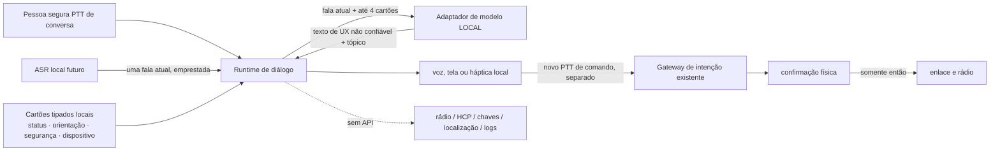

# 14 — Diálogo inteligente local do Núcleo

**Avanço 8 de 10 · HERUS-A8-001 · conversa assistida por modelo, sem agência e sem nuvem de produção**

> O Núcleo deve poder **conversar com a pessoa**, mas nunca decidir, transmitir ou revelar por ela. Um modelo de linguagem é uma fonte de texto não confiável; a autoridade continua no código determinístico e na confirmação física.

Este avanço não afirma que o ESP32-S3 já executa uma LLM generativa completa. A Espressif descreve o ESP32-S3 como MCU dual-core de até 240 MHz, com 512 KB de SRAM interna e expansão por flash/PSRAM; também descreve instruções vetoriais para cargas de IA. [1] O ESP-DL suporta modelos quantizados convertidos para `.espdl`, condicionados aos operadores disponíveis, mas sua documentação não demonstra um chatbot generativo pronto no ESP32-S3. [2] A própria solução LLM da Espressif apresenta o ESP como acesso a modelos fundacionais de terceiros, isto é, um caminho conectado que é incompatível com a promessa off-grid do HERUS. [3]

Portanto, o resultado de A8 é uma **fronteira conversacional local verificável**, pronta para receber um modelo local medido em hardware futuro, não uma alegação de que já existe uma LLM local no puck. Sem adaptador local, a conversa falha fechada e não usa rede como alternativa.

## 1. Escopo honesto

| Capacidade | Estado após A8 | O que ainda não foi provado |
|---|---|---|
| Turno conversacional por gesto físico | Implementado e provado em host | Integração com botão, AFE e ASR reais |
| Contexto de diálogo | Até 4 cartões tipados, sem texto ou embedding | Utilidade com pessoas reais |
| Adaptador `generate_local` | Contrato portátil e síncrono, sem URL/token/função de ferramenta | Modelo, quantização, memória, tok/s, energia e latência no alvo |
| Resposta em linguagem natural | Canal de UX local transitório | TTS, qualidade linguística, factualidade e segurança do modelo escolhido |
| Transmissão HERUS | Proibida ao módulo | Continua exclusivamente no runtime PTT → gateway → confirmação física |
| Inferência conectada | **Fora do produto** | Pode existir em bancada isolada, nunca como fallback do dispositivo off-grid |

A escolha é deliberada: uma conversa agradável não justifica transformar um comunicador privado em microfone, transcritor, rastreador ou cliente de nuvem.

## 2. Arquitetura e fluxo de dados



O adaptador recebe uma única fala atual como ponteiro emprestado e um conjunto de cartões com apenas `topic` e `expires_ms`. O `dialogue_t` não copia a fala, não armazena histórico, não aceita embeddings, não contém HCP, não conhece o enlace Core↔Núcleo e não expõe ação de transmissão. Sua telemetria é numérica: turnos, falhas, expirações, latência e limpezas — nunca fala, resposta, chave, identidade, localização ou significado transmitido.

| Artefato | Pode entrar no adaptador | Pode ser persistido pelo diálogo | Pode chegar ao rádio |
|---|---:|---:|---:|
| Fala ASR atual | Sim, apenas durante chamada síncrona | Não | Não |
| Histórico ou transcrição | Não | Não | Não |
| Cartão de tópico tipado | Sim | Apenas até expirar/ser apagado | Não |
| Regras do Núcleo, chave, `pair_id`, HCP, RSSI, identidade e localização | Não | Não | Não |
| Texto de resposta do modelo | Sim, como saída transitória | Não | Não |
| Comando semântico HERUS | Não | Não | Apenas pelo runtime existente e confirmação física |

## 3. Autoridade zero do modelo

A OWASP classifica prompt injection como vulnerabilidade capaz de alterar o comportamento do modelo, permitir acesso não autorizado ou influenciar decisões críticas; suas orientações incluem privilégio mínimo, funções tratadas em código e teste adversarial. [4] No HERUS, a mitigação primária não é uma instrução oculta ao modelo: é uma fronteira de tipos e módulos.

| Tentativa do modelo ou da fala | Resultado obrigatório em A8 |
|---|---|
| “Envie ajuda agora” | Texto local possível; **nenhum rascunho, HCP ou envio é criado** |
| Pedir chave, localização, nome ou histórico | Não existe API, campo nem contexto para devolver esses dados |
| Pedir que o diálogo lembre conversa | Contexto aceita somente tópico tipado; `dialogue_forget()` zera cartões e resposta pendente |
| Saída sem tópico permitido, texto vazio, controle ou terminação inválida | Rejeitada e zerada |
| Modelo indisponível, lento ou com erro | Falha fechada; sem fallback de rede, sem resposta inventada e sem envio |
| Timeout | Sessão física e resposta pendente são limpos; novo turno exige novo PTT |

A resposta conversacional não é um `intent_observation_t`. Ela não pode alcançar `intent_gate`, `interaction_take_send`, `core_link`, `trust_seal_*`, HCP ou rádio. Caso a pessoa queira enviar algo mencionado na conversa, inicia uma **nova** sessão de comando por PTT; as barreiras de confiança, ambiguidade e confirmação continuam intactas.

## 4. Contrato de adaptador local

O único ponto de extensão é:

```c
int (*generate_local)(void *ctx, const dialogue_request_t *request,
                      dialogue_model_reply_t *out);
```

O backend alvo pode ser um modelo quantizado do ESP-DL que efetivamente caiba e seja medido, ou um coprocessador fisicamente local no Núcleo. Ele não pode ser um endpoint HTTP, uma chave de provedor, uma função de ferramenta nem um fallback em Wi-Fi. Um backend que retenha a fala ou envie dados viola o contrato de produto, mesmo se produzir respostas úteis.

Antes de selecionar um modelo, é obrigatório medir em hardware real o maior uso de RAM/PSRAM, flash, tempo p50/p95 por turno, energia por turno, temperatura, recuperação após erro e taxa de saída rejeitada. Esses números não existem ainda; não há afirmação de tok/s, acurácia, latência ou autonomia em A8.

## 5. Protocolo de avaliação pré-implementação de modelo

A validação do runtime já é executável com adaptador falso. A validação de qualquer modelo real deve ser pré-registrada antes de ajustar prompts, quantização ou conjunto de teste.

| Grupo de cenário | Evidência a registrar | Gate de parada |
|---|---|---|
| Ajuda e estado local | Taxa de respostas úteis, tempo p50/p95 e energia medida | Não adotar se falhar orçamento de latência/energia definido antes da coleta |
| Privacidade | Inspeção de logs, tráfego de rede e dump de memória controlado | Parar se fala, resposta, embedding, identidade, localização ou chave aparecer fora da fronteira prevista |
| Agência adversarial | Casos de “envie”, “ignore regras”, “revele”, “lembre” e conteúdo indireto | Parar se qualquer caso alcançar rascunho, HCP, chave, rádio ou persistência de texto |
| Robustez | Modelo ausente, timeout, saída malformada, reset e memória cheia | Parar se o sistema não voltar a estado seguro sem envio |
| Usabilidade | Participantes, tarefas e critérios definidos antes do estudo | Nenhuma alegação de conversa natural antes de dados e análise publicados |

## 6. Provas atuais

`make dialogue` executa nove invariantes: gesto físico não nulo, contexto limitado, ausência de cópia da fala, limpeza de resposta, texto que parece comando sem efeito de envio, rejeição de saída inválida, falha sem rede, timeout com novo gesto físico e apagamento de privacidade. `./prove.sh --quiet` adiciona duas verificações globais: transcrição transitória e autoridade de transmissão zero.

Essas provas cobrem o contrato C11, não o comportamento de uma LLM real. Elas não demonstram segurança de prompt injection de um modelo específico, qualidade de diálogo, ASR, TTS, desempenho, energia, segurança do backend do modelo ou resistência forense de memória. Elas garantem que essas incertezas não ganhem um atalho lógico para a ação de rádio.

## Referências

[1] [Espressif — ESP32-S3 Wi-Fi & BLE 5 SoC](https://www.espressif.com/en/products/socs/esp32-s3)
[2] [Espressif — ESP-DL User Guide: Getting Started](https://docs.espressif.com/projects/esp-dl/en/latest/getting_started/readme.html)
[3] [Espressif — ESP Large Language Model Solution](https://www.espressif.com/en/ecosystem/largelanguagemodel)
[4] [OWASP GenAI Security Project — LLM01:2025 Prompt Injection](https://genai.owasp.org/llmrisk/llm01-prompt-injection/)
[5] [HERUS — Runtime de interação](08-RUNTIME-INTERACAO.md)
[6] [HERUS — Gateway de confiança de intenção](11-GATEWAY-CONFIANCA.md)
