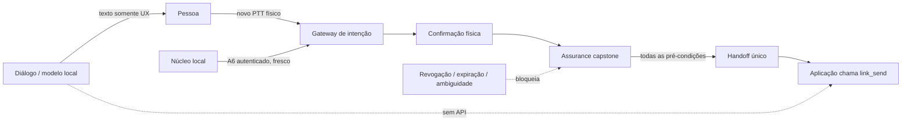

# 16 — Grand Finale: integração verificável e passagem para a bancada

**Avanço 10 de 10 · HERUS-A10-001 · release candidate de engenharia, não um resultado físico**

> O HERUS não está “pronto” porque uma narrativa de arquitetura parece completa. Ele está pronto para a **primeira bancada** quando cada contrato de software falha fechado, cada lacuna física é visível e nenhum gate pendente é apresentado como aprovado.

O Grand Finale fecha os dez avanços como uma integração testável. Ele não acrescenta uma rota de rádio, não executa uma LLM, não coleta telemetria de pessoas, não grava áudio e não substitui a confirmação física. Sua função é provar que as camadas já criadas não se contradizem quando colocadas em sequência e preparar o registro que transformará a primeira medição em evidência, não em opinião.

## 1. Resultado do Avanço 10

| Artefato | Responsabilidade | Limite deliberado |
|---|---|---|
| `core/assurance.[ch]` | Reúne pré-condições tipadas e falha fechado em ausência de PTT, intenção aceita, confirmação, handoff único, vínculo/link ou fronteira de modelo | Não cria HCP, pacote, chave, rádio, envio ou log |
| `interaction_take_send_assured()` | Acrescenta assurance como bloqueio antes do handoff único do runtime | Não substitui `interaction_take_send()` nem torna snapshot uma fonte de autoridade |
| `test_capstone.c` | Ataca a cadeia diálogo → modelo → intenção → confiança → handoff | Não é ASR, LLM, BLE, energia ou ensaio de campo |
| `research/hardware_readiness_manifest.json` | Congela gates, privacidade e evidência requerida para a bancada | Todos os nove gates começam **pendentes**; nenhum número físico é preenchido |
| `tools/readiness_audit.py` | Rejeita aprovação sem arquivo de evidência, campos privados e esquema inconsistente | Não mede hardware nem garante a honestidade de uma fonte externa |

A composição segue o princípio do menor privilégio. O modelo pode responder localmente, mas sua saída não se torna `intent_observation_t`; o runtime pode ter rascunho confirmado, mas só devolve um handoff único; o Núcleo pode fornecer observação autenticada, mas exige vínculo ativo, envelope fresco e confirmação; revogação posterior domina o estado anterior.



## 2. Matriz de precedência provada

| Situação atacada | Resultado executável | Por que é relevante |
|---|---|---|
| Texto de modelo: “envie ajuda agora” | É entregue apenas como UX; não cria rascunho ou handoff | Prompt ou resposta não recebem agência |
| Sem PTT, intenção aceita, confirmação ou handoff livre | `assurance_decide()` bloqueia | Sem estado físico completo não existe liberação |
| Modelo habilitado sem perfil A9 ou sem display-only | Bloqueia, mesmo com confirmação | Inteligência não substitui evidência nem limitação de autoridade |
| Nucleus sem trust, autenticação ou frescor | Bloqueia | Observação remota local não é confiável só por existir |
| Revogação com falha de erase persistente | Estado continua `TRUST_REVOKED`; envelope e handoff assegurado bloqueiam | Falha de armazenamento não reativa credencial antiga |
| Handoff já usado | Runtime volta a `IDLE`; nova tomada é recusada | Não existe retransmissão lógica do mesmo significado |

As provas host não dizem que o hardware apresenta esses estados corretamente. Elas dizem que, se adaptadores fornecerem estados ausentes, inconsistentes, expirados ou revogados, o código portável não os transforma permissivamente em liberação.

## 3. Estado de evidência

| Nível | O que pode ser afirmado agora | O que continua proibido afirmar |
|---|---|---|
| C11 em host | As 16 suítes exercitam contratos determinísticos, recusa de estados inseguros e composição capstone | Que ESP32-S3, SX1262, BLE, secure element, ASR, haptics ou LLM executem corretamente |
| Simulador | As 74 invariantes do modelo simulado passam sob seus parâmetros declarados | Alcance, PDR, energia, interferência, autonomia ou segurança física no local de uso |
| Manifesto de readiness | A lista de nove evidências requeridas é versionada e validada | Que qualquer gate físico foi aprovado |
| Hardware | **Nenhuma evidência coletada neste repositório** | Métrica, qualidade, UX, consumo, temperatura ou comportamento de campo |

Essa separação é intencional. O NIST AI RMF para IA generativa enquadra confiabilidade como consideração de desenho, desenvolvimento, uso e avaliação; a fronteira de modelo A8/A9 e a prova A10 aplicam isso como estado tipado e aceitação fail-closed, não como afirmação de qualidade de uma LLM. [1] O guia ESP-DL também separa carregamento, teste e profiling de memória/latência; a decisão de A9/A10 exige esse perfil no alvo antes de habilitar um adaptador. [2]

## 4. Manifesto de prontidão da Fase 0

O manifesto não é uma lista de desejos. Cada gate descreve uma questão, a evidência mínima e a única afirmação que poderá ser feita se passar. O auditor exige que um gate marcado `pass` tenha arquivo de evidência versionado e que nenhuma entrada de produto registre áudio, transcrição, embedding, identidade, localização, chave ou conteúdo de mensagem.

| Gate pendente | Evidência mínima | Decisão que permite |
|---|---|---|
| `board-pin-map` | Revisão, esquema e self-test | Usar o HAL para a placa declarada |
| `mechanical-volume` | Altura medida, revisão de shell e pilha | Afirmar somente encaixe da pilha testada |
| `radio-bring-up` | Perfil, contagens, RSSI e self-test | Estabelecer baseline de duas placas a um metro |
| `urban-pdr` | Rota, distância, contagens e digest do log | Reportar PDR apenas da rota/condições testadas |
| `tier05-comparison` | Perfis pareados, rota e resumo | Aceitar ou rejeitar a hipótese Tier 0.5 naquele setup |
| `energy-instrumentation` | Instrumento, método, energia e unidade | Reportar energia da carga/instrumento declarados |
| `interaction-io` | Revisão de adaptador, digest anonimizado, latência e energia | Aplicar gate somente ao protocolo e população declarados |
| `companion-trust-port` | Backend, RNG, transporte e teste de revogação | Dizer que o port da revisão foi exercitado |
| `local-model-profile` | Digest, memória, p95, energia e manifesto adversarial | Aceitar apenas o modelo/configuração identificados |

## 5. Procedimento de passagem para a bancada

Antes de qualquer flash, execute e guarde o veredito reproduzível:

```bash
./prove.sh --quiet
python3 tools/readiness_audit.py research/hardware_readiness_manifest.json --strict
```

Depois, siga a Fase 0 já congelada no [guia de construção](03-BUILD-GUIDE.md): conferir revisão/pin map, fechar a pilha de volume e operar os dois LilyGO T3-S3 a um metro antes de caminhar a rota urbana. Não reescreva a hipótese depois de ver o resultado: atualize o gate correspondente com arquivo de evidência, revisão, método e resultado `pass` ou `rejected`.

> **Stop/go obrigatório.** Se o baseline de prova falhar, não flash. Se a placa não corresponder ao pin map, não caminhe. Se a altura exceder o critério congelado, mude o fator de forma. Se o rádio não produzir CSV limpo a um metro, depure a bancada antes de coletar alcance. Se um gate físico falhar, registre `rejected`; não rebaixe silenciosamente o critério.

## 6. O que os próximos dados devem decidir

O Grand Finale conclui a sequência de software, mas não encerra o projeto. A próxima evidência deve decidir, em ordem, a viabilidade mecânica do vestível, a linha de base RF, a hipótese Tier 0.5 e o orçamento energético. Integração de BLE/secure storage, ASR/haptics e modelo local só devem avançar quando seus respectivos gates tiverem instrumento, corpus/protocolo congelado e evidência no alvo.

A regra continua simples: se uma alegação não pode falhar por um teste ou uma medição guardada, ela não é resultado do HERUS.

## Referências

[1] [NIST AI 600-1 — Artificial Intelligence Risk Management Framework: Generative Artificial Intelligence Profile](https://www.nist.gov/publications/artificial-intelligence-risk-management-framework-generative-artificial-intelligence)
[2] [Espressif — ESP-DL: How to load, test and profile a model](https://docs.espressif.com/projects/esp-dl/en/latest/tutorials/how_to_load_test_profile_model.html)
[3] [HERUS — Guia de construção e critérios de interrupção](03-BUILD-GUIDE.md)
[4] [HERUS — Diálogo inteligente local](14-DIALOGO-LLM-LOCAL.md)
[5] [HERUS — Laboratório de aceitação do modelo local](15-LAB-ACEITACAO-MODELO.md)
