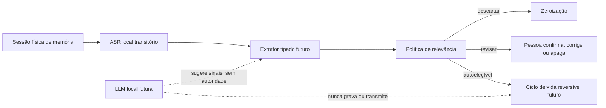

# 17 — Memória seletiva: relevância antes de retenção

**Série de inteligência do HERUS · Passo 1 de 8 · política executável, não captura de fala**

> O HERUS não deve gravar uma vida inteira para depois chamá-la de memória. Ele deve reter, com consentimento, apenas o significado que uma pessoa provavelmente desejará recuperar no futuro.

Este primeiro passo estabelece a política de relevância para o futuro complemento de memória pessoal do Núcleo. Ele não captura áudio, não executa ASR, não guarda transcrição, não chama uma LLM, não persiste dados e não envia nada por rádio. Em vez disso, recebe sinais **tipados** produzidos por uma camada futura de extração já autorizada e decide se o candidato deve ser descartado, revisado pela pessoa ou tornar-se elegível para consolidação reversível.

A separação é deliberada. O NIST Privacy Framework trata a gestão de riscos de privacidade como parte da construção de produtos inovadores; para o HERUS, isso significa que propósito, minimização e controle devem existir antes do armazenamento. [1] O perfil de IA generativa do NIST também identifica confabulação, privacidade e configuração humano-IA como riscos que exigem gestão durante todo o ciclo de vida. [2]

## 1. O que o HERUS chama de memória

Uma memória HERUS não é uma gravação e não é automaticamente uma verdade. Ela será, nos próximos passos, um **cartão semântico mínimo** com procedência, confiança, ciclo de revisão e direito de esquecimento.

| Elemento | Permitido na política atual | Proibido na política atual |
|---|---|---|
| Entrada | Tipo de lembrança, escopo, sensibilidade, confiança, novidade, valor futuro e consequência | Áudio, transcrição, embedding, identidade, localização, chave, conteúdo da fala e prompt |
| Saída | Disposição, escore de relevância e razões tipadas | Escrita em armazenamento, mensagem, comando, decisão externa ou ação do modelo |
| Função | Decidir quão conservadora deve ser a próxima camada | Inferir que algo é verdadeiro, importante para sempre ou autorizado a sair do dispositivo |

O campo `relevance_score` é uma medida de **potencial de recuperação futura**, não de verdade, valor moral, prioridade social ou certeza factual.

## 2. Tipos de lembrança que podem ser candidatos

| Tipo | Exemplo de significado futuro | Tratamento inicial |
|---|---|---|
| Ideia | “O Núcleo deve ser um segundo cérebro privado.” | Avaliar novidade e relação com projeto; revisar se não for claramente útil |
| Decisão | “Vamos começar por memória seletiva.” | Sinal reforçado; elegível se ordinária, de si e confiável |
| Compromisso | “Vou revisar o protótipo na sexta.” | Sinal reforçado; camada futura deve exigir prazo/procedência antes de converter em rotina ou lembrete |
| Preferência | “Prefiro respostas curtas em campo.” | Candidato; não deve alterar configuração sem revisão humana |
| Fato de projeto | “O rádio ainda não foi medido em hardware.” | Candidato com relação ao projeto; nunca vira alegação externa sem evidência |
| Rotina | “Costumo levar lanterna na trilha.” | Candidato de baixa confiança até ser confirmado ou repetido em sessões autorizadas |

A política não classifica conteúdo médico, jurídico, financeiro, íntimo ou relativo a outra pessoa como memória automática. Essas categorias são futuras entradas de alto risco, não atalhos de personalização.

## 3. Decisão em três saídas

| Disposição | Condição | Efeito no Passo 1 |
|---|---|---|
| **Descartar** | Sem sessão autorizada, extração abaixo de 70% de confiança, dados malformados ou relevância baixa | Não existe candidato para a camada de persistência futura |
| **Revisar** | Relevância intermediária, escopo misto/de terceiros, dado pessoal ou sensível | A pessoa deverá confirmar, corrigir ou apagar antes de consolidar |
| **Autoelegível** | Sessão autorizada, alta confiança, escopo próprio, conteúdo ordinário e alto valor futuro; ou pedido explícito de lembrar nessas mesmas condições | Apenas permite que a futura camada de ciclo de vida proponha uma escrita reversível; não escreve agora |

O sistema é assimétrico: é melhor perder uma conversa banal do que reter informação íntima, ambígua ou de outra pessoa por engano. Pedido explícito de lembrar aumenta a relevância, mas não remove as proteções para sensibilidade e terceiros.

## 4. Regra de relevância explicável

Para candidatos ordinários sobre a própria pessoa, o escore é calculado de forma determinística:

```text
relevância = 25% novidade + 45% valor de recuperação futura + 30% consequência
```

Decisões e compromissos recebem reforço de 10 pontos, limitado a 100. A ênfase maior em valor futuro expressa o objetivo do HERUS: complementar lacunas de memória, não recompensar fala frequente, emoção momentânea ou conteúdo longo.

| Razão tipada | Significado |
|---|---|
| `EXPLICIT` | A pessoa pediu para lembrar |
| `DECISIONAL` | O candidato é decisão ou compromisso |
| `FUTURE_VALUE`, `NOVEL`, `CONSEQUENTIAL` | Os sinais que compuseram a avaliação |
| `SENSITIVE`, `THIRD_PARTY` | Nunca automatizar a retenção; enviar para revisão |
| `LOW_CONFIDENCE`, `AMBIGUOUS`, `LOW_RELEVANCE` | Motivo de descarte conservador |

## 5. Garantias já executáveis

A suíte `make memory-policy` prova que:

1. fala fora de uma sessão autorizada é descartada antes mesmo de calcular relevância;
2. extração ambígua não se torna memória só porque parece importante;
3. conversa ordinária de baixo valor é esquecida;
4. candidatos intermediários seguem para revisão, não para retenção automática;
5. decisão própria, ordinária e confiável pode ser elegível para consolidação reversível;
6. pedido explícito não elimina controles para conteúdo pessoal sensível ou de terceiros;
7. o módulo não aceita candidato sem tipo e não possui caminho de persistência.

Essas provas são em host C11. Elas não validam um microfone, ASR, LLM, classificação semântica real, armazenamento cifrado, UX de consentimento, energia ou desempenho no Núcleo físico.

## 6. Fronteira com a LLM local

O classificador de relevância inicial é determinístico porque ainda não existe perfil de LLM local aceito no alvo. Uma futura LLM poderá sugerir sinais tipados, mas não poderá alterar a política nem consolidar memória diretamente.



O perfil NIST AI 600-1 observa que modelos generativos podem produzir conteúdo confiante mas incorreto e que configurações humano-IA podem induzir excesso de confiança. [2] Por isso, o HERUS deve apresentar procedência, incerteza e opção de correção em vez de dizer “eu me lembro com certeza”.

## 7. Próximo passo

O Passo 2 criará uma sessão explícita de captura de memória: gesto físico, indicador de coleta, janela limitada, descarte obrigatório de áudio/transcrição provisórios e nenhuma chamada de modelo ou persistência após expiração. Só então o Passo 3 poderá transformar sinais reais de extração em candidatos semânticos.

## Referências

[1] [NIST Privacy Framework](https://www.nist.gov/privacy-framework)

[2] [NIST AI 600-1 — Artificial Intelligence Risk Management Framework: Generative Artificial Intelligence Profile](https://doi.org/10.6028/NIST.AI.600-1)
