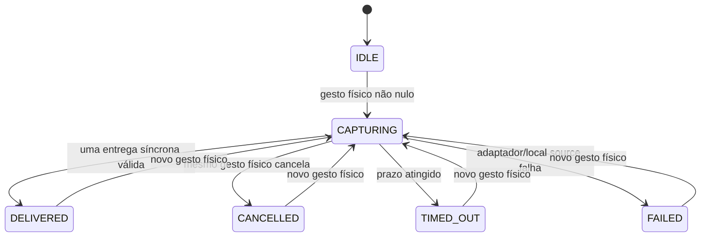

# 18 — Sessão de captura de memória: gesto, limite e descarte

**Série de inteligência do HERUS · Passo 2 de 8 · sessão portátil, sem microfone nem retenção**

> O HERUS só pode ouvir para memória quando a pessoa o coloca explicitamente nesse estado — e deve deixar de ouvir, descartar e esquecer assim que a sessão termina.

A política de relevância do Passo 1 decide o que uma futura extração **poderia** considerar uma lembrança. Este Passo 2 cria a porta anterior: uma máquina de estados que autoriza uma única janela transitória de captura após gesto físico, impõe prazo e exige descarte em todo encerramento.

O módulo `memory_capture.[ch]` não acessa microfone, I2S, AFE, VAD, ASR, LLM, cofre, rádio, rede ou armazenamento. Ele não contém áudio, texto, transcrição, embedding, identidade, localização, chave ou candidato semântico.

## 1. Por que a captura precisa de contrato próprio

O NIST Privacy Framework trata coleta, retenção, logging, transformação, uso, transmissão e descarte como ações de dados distintas ao longo de um ciclo de vida. [1] Para um segundo cérebro pessoal, portanto, um botão de início e uma rotina de limpeza não são meros detalhes de interface: são fronteiras de privacidade que precisam existir antes de qualquer inteligência de memória.

A Espressif documenta que seu Audio Front-End pode processar áudio em quadros e publicar estado de atividade de voz (VAD) em tempo real. [2] Isso é compatível com uma adaptação futura de janela limitada. Não é, porém, evidência de que o HERUS já captura fala no ESP32-S3, nem autorização para introduzir wake word ou microfone sempre ativo.

## 2. Máquina de estados



| Estado | Significado | Captura permitida? | Material transitório |
|---|---|---:|---|
| `IDLE` | Nenhuma autorização de memória viva | Não | Não existe no módulo |
| `CAPTURING` | Gesto físico abriu uma janela limitada | Somente por adaptador local | Apenas buffer emprestado para uma entrega síncrona |
| `DELIVERED` | Uma entrega válida foi consumida pelo adaptador seguinte | Não | Buffer foi zeroizado e sessão revogada |
| `CANCELLED` | Pessoa encerrou explicitamente a janela | Não | Adaptador recebe pedido de descarte |
| `TIMED_OUT` | A janela acabou sem depender do VAD | Não | Adaptador recebe pedido de descarte |
| `FAILED` | Fonte ou adaptador local falhou | Não | Adaptador recebe pedido de descarte |

Cada abertura recebe um novo `capture_session_id`. O identificador ativo é apagado no encerramento; um contador de geração separado impede que um buffer atrasado de uma sessão antiga seja aceito por uma nova.

## 3. Efeitos permitidos ao adaptador de hardware

O runtime portátil produz apenas quatro efeitos sem conteúdo:

| Efeito | Uso futuro no alvo | Não concede |
|---|---|---|
| `start_capture` | Iniciar AFE/VAD/ASR após gesto visível | Escuta permanente, persistência ou envio |
| `stop_capture` | Interromper a fonte local em todo encerramento | Leitura de dados já descartados |
| `memory_indicator` | Acender LED, exibir estado ou hapticamente sinalizar “memória ativa” | Prova de que áudio foi gravado |
| `discard_transient` | Limpar buffer de DMA/AFE/ASR pertencente ao adaptador | Apagar qualquer memória consolidada futura |

O sistema alvo deverá ligar o indicador de captura à mesma sessão que controla a fonte. Um LED decorativo não é suficiente se o adaptador puder continuar coletando após o término lógico.

## 4. Entrega única e zeroização

A função `memory_capture_deliver()` aceita no máximo um buffer de até 4096 bytes para a sessão ativa. O buffer é propriedade do chamador e só pode ser observado de forma síncrona pelo adaptador de extração futura. Logo depois da chamada — com sucesso, falha, sessão errada, expiração ou rejeição — a função sobrescreve os bytes com zero.

| Situação | Adaptador de extração recebe bytes? | Buffer é zeroizado? | Sessão continua? |
|---|---:|---:|---:|
| ID de sessão correto, dentro do prazo | Sim, uma vez | Sim, após retorno | Não; fecha como `DELIVERED` |
| ID errado ou tardio | Não | Sim | Sim, se a sessão correta ainda está viva |
| Cancelamento ou timeout | Não | Nenhum buffer interno existe; o adaptador recebe `discard_transient` | Não |
| Erro do adaptador | Pode ter visto a chamada síncrona | Sim | Não; fecha como `FAILED` |
| Sem adaptador | Não | Sim | Não; fecha como `FAILED` |

A zeroização observável em host é uma garantia de contrato C. No hardware, a integração deverá provar também a limpeza de buffers de DMA, I2S, AFE, ASR e qualquer memória acelerada que esteja fora deste objeto portátil.

## 5. Barreiras de autoridade

A sessão de memória não é uma sessão de comunicação. Ela não compartilha o `session_id` do runtime push-to-talk, não cria `intent_observation_t`, não cria HCP, não chama `memory_policy_assess()`, não grava no cofre e não encaminha conteúdo ao Núcleo remoto.

O fluxo correto nos próximos passos será:

```text
Gesto de memória → captura limitada → extração tipada local → política de relevância
                    ↓                                      ↓
                 descarte                            descartar / revisar / elegível
```

Cada seta será adicionada apenas quando seu contrato anterior estiver provado. Uma LLM local futura poderá auxiliar a extração, mas nunca recebe o direito de prolongar a captura, salvar o buffer, burlar o consentimento ou transmitir conteúdo.

## 6. Provas executáveis

```bash
cd firmware
make memory-capture
```

A suíte prova que:

1. nenhum estado de captura inicia sem gesto físico não nulo;
2. uma sessão viva não pode ser substituída ou reaberta;
3. buffer com identificador errado é rejeitado e limpo sem chegar ao adaptador;
4. uma entrega válida é síncrona, única, limpa o buffer e encerra a sessão;
5. um buffer de sessão antiga não entra em uma sessão posterior;
6. cancelamento, timeout e falha revogam a sessão e requisitam descarte ao adaptador;
7. expiração independe de VAD ou silêncio da fonte.

Essas são provas de host em C11. Ainda não existem medição de microfone, teste de vazamento acústico, AFE/VAD do ESP-SR, ASR em português, latência percebida, consumo, indicadores físicos ou coleta com participantes.

## 7. Próximo passo

O Passo 3 já introduziu o [extrator local de candidatos](19-EXTRACAO-CANDIDATOS.md). Ele recebe uma entrada transitória já autorizada, produz somente sinais tipados para `memory_policy`, usa gramática/saída verificável e permanece incapaz de persistir, enviar ou tratar sua interpretação como verdade. O próximo limite será o cofre cifrado e reversível do Passo 4.

## Referências

[1] [NIST Privacy Framework v1.0](https://www.nist.gov/document/nist-privacy-frameworkv10pdf)

[2] [Espressif ESP-SR — Audio Front-End Framework](https://docs.espressif.com/projects/esp-sr/en/latest/esp32s3/audio_front_end/README.html)
