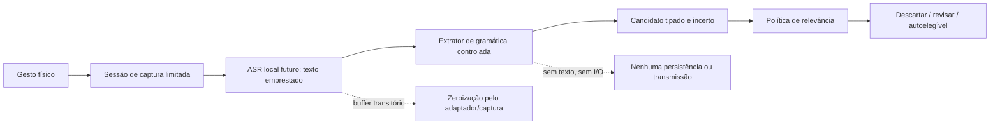

# 19 — Extração local de candidatos: interpretar sem inventar

**Série de inteligência do HERUS · Passo 3 de 8 · candidato tipado, não memória persistente**

> O HERUS pode reconhecer uma forma conhecida de intenção. Ele não deve transformar uma interpretação de fala em verdade, registro permanente ou ação autônoma.

Os Passos 1 e 2 definiram, respectivamente, **o que pode merecer memória** e **quando uma sessão de captura é autorizada**. Este Passo 3 cria a camada intermediária: um extrator local de gramática controlada que transforma uma entrada textual transitória, já normalizada por um adaptador de ASR futuro, em um `memory_candidate_t` sem texto e sem persistência.

O módulo `memory_extract.[ch]` não é ASR, LLM, gravador, banco de dados ou canal de comunicação. Ele não recebe áudio, não opera microfone/AFE/VAD, não mantém o ponteiro da entrada, não produz resumo textual, não armazena candidato e não tem include ou API de HCP, trust, link, diálogo ou rádio.

## 1. Por que extrair não é lembrar

A documentação do MultiNet da Espressif descreve reconhecimento local de um conjunto limitado de comandos, com IDs de frases e probabilidades retornadas pelo modelo. [1] Isso é uma base adequada para um HERUS conservador: um adaptador futuro deve oferecer observação local tipada e confiança, em vez de fingir que qualquer frase aberta foi perfeitamente entendida.

O NIST AI 600-1 identifica confabulação como conteúdo errado ou inconsistente apresentado com confiança e trata privacidade e configuração humano–IA como riscos próprios. [2] Consequentemente, o HERUS registra a **origem da extração** e a **confiança do adaptador**, mas nunca declara que o candidato é um fato. Já o NIST Privacy Framework trata transformação, retenção e descarte como ações diferentes de dados; transformar uma fala transitória em sinal tipado é uma fronteira de privacidade independente da captura. [3]

## 2. Fluxo local e sem retenção



A chamada `memory_extract_text()` exige que `capture_session_id` corresponda a uma sessão `CAPTURING` viva. Se o ID for zero, antigo, cancelado ou expirado, não existe candidato. Isso preserva a fronteira de consentimento do Passo 2 até a última chamada de extração.

## 3. Gramática inicial

A gramática é deliberadamente pequena. O objetivo é criar uma base falsificável antes de tentar compreensão mais ampla por um modelo local mensurado.

| Classe de candidato | Marcadores controlados atuais | Sinais padrão de valor futuro |
|---|---|---|
| Ideia | `ideia`, `pensei`, `imagino` | novidade alta, valor futuro alto |
| Decisão | `decidimos`, `decidi`, `vamos` | consequência e valor futuro altos |
| Compromisso | `eu vou`, `me comprometo`, `combino` | consequência alta, mas ainda não é lembrete automático |
| Preferência | `prefiro`, `nao gosto`, `gosto de` | valor futuro moderado, revisão possível |
| Fato de projeto | `herus`, `nucleo`, `projeto` | relação explícita com trabalho/produto |
| Rotina | `costumo`, `sempre levo`, `minha rotina` | candidato fraco até que passos posteriores definam repetição e confirmação |

`lembre`, `guarde` e `anote` sinalizam um pedido explícito, mas não bastam sozinhos: a frase também precisa corresponder a uma classe controlada. Isso evita que “lembre isso” crie uma memória vazia ou que o extrator invente qual foi o objeto pretendido.

A linguagem atual é um fixture portátil sem acentuação obrigatória e não representa ASR aberto em português. Frase fora da gramática é `NO_CANDIDATE`; ela não recebe uma inferência criativa.

## 4. Saída semântica e incerteza

O extrator retorna somente:

| Campo | Papel | Não representa |
|---|---|---|
| `memory_signal_t` | Tipo, escopo, sensibilidade, pedido explícito, confiança e sinais de relevância para a política | Conteúdo da fala, resumo, embedding ou memória gravada |
| `origin` | `EXPLICIT` ou `CONTROLLED_INFERENCE` | Prova de verdade, autoria ou consentimento de outra pessoa |
| `reasons` | Razões numéricas como ideia, decisão, terceiro, sensível ou ambíguo | Log textual ou cadeia de raciocínio de modelo |

A confiança de ASR é recebida como dado do adaptador local e deve estar entre 0 e 100. Abaixo do limiar da política, o extrator marca ambiguidade e a composição `memory_extract_assess()` devolve descarte. A gramática nunca “compensa” baixa confiança.

## 5. Terceiros e sensibilidade

O extrator procura marcadores limitados de referência a outra pessoa e de risco pessoal/sensível. Ao encontrá-los, marca `MEMORY_SCOPE_THIRD_PARTY`/`MIXED` e/ou `MEMORY_SENSITIVITY_SENSITIVE`. A política existente encaminha esses casos obrigatoriamente para `REVIEW`.

| Condição detectada | Disposição que o extrator permite | Resultado da política |
|---|---|---|
| Ideia própria ordinária, pedido explícito e confiança alta | Candidato tipado | Pode ser `AUTO_ELIGIBLE`; ainda não persiste |
| Decisão própria reconhecida | Candidato tipado com origem inferida | Avaliação explicável; não é fato externo |
| Confiança baixa | Candidato marcado ambíguo | `DISCARD` |
| Terceiro, escopo misto ou conteúdo sensível | Candidato marcado de risco | `REVIEW`, nunca retenção automática |
| Frase livre não reconhecida | Nenhum candidato | `DISCARD` implícito; não chama política |

A lista de marcadores é defesa de primeira camada, não detector universal de dados sensíveis. Antes de qualquer uso real, ela precisa de corpus, avaliação de falsos positivos/falsos negativos, revisão de linguagem e experimento pré-registrado. Não há alegação de cobertura semântica neste passo.

## 6. Provas executáveis

```bash
cd firmware
make memory-extract
```

A suíte prova que:

1. sem uma sessão de captura viva não há candidato;
2. conversa livre fora da gramática é descartada;
3. ideia própria pedida explicitamente gera sinal tipado sem carregar texto;
4. alterar o buffer do chamador após extração não altera o candidato;
5. decisão controlada é uma interpretação marcada, não um fato;
6. conteúdo sensível sobre outra pessoa é encaminhado para revisão;
7. baixa confiança de ASR não vira memória pela força da gramática;
8. entrada grande é rejeitada antes da gramática e uma sessão cancelada não pode ser reutilizada;
9. métricas são numéricas e não incluem payload textual.

A composição com `memory_policy` só retorna uma disposição de privacidade. Não existe escrita de cofre, rascunho de comunicação, HCP, pacote, trust, Link ou rádio neste módulo.

## 7. Limites honestos

| Ainda não existe | Por que não é alegado agora |
|---|---|
| ASR em português no ESP32-S3 | Não há integração, corpus, WER, intenção correta ou avaliação de ruído medida |
| LLM local | Não há perfil de alvo, pesos, memória, p95, energia ou avaliação de segurança aceitos |
| Resumo ou conteúdo de memória | A saída não possui campo textual; o cofre do Passo 4 ainda não foi definido |
| Compreensão de conversa aberta | A gramática atual é deliberadamente limitada e falha fechada |
| Detecção completa de conteúdo de terceiros/sensível | Marcadores são testes de segurança, não classificação semântica universal |
| Integração AFE/VAD/I2S/DMA | O Passo 2 só prova o contrato portátil de captura; hardware precisa ser medido |

## 8. Próximo passo

O Passo 4 criará o cofre local de memória: um formato de cartão semântico mínimo, persistência cifrada, interface de armazenamento protegido, procedência, acesso e apagamento verificável. O cofre só aceitará candidatos já avaliados; ele nunca receberá áudio bruto, transcrição persistente ou uma LLM com autoridade de escrita direta.

## Referências

[1] [Espressif ESP-SR — MultiNet Command Word Recognition](https://docs.espressif.com/projects/esp-sr/en/latest/esp32s3/speech_command_recognition/README.html)

[2] [NIST AI 600-1 — Artificial Intelligence Risk Management Framework: Generative Artificial Intelligence Profile](https://doi.org/10.6028/NIST.AI.600-1)

[3] [NIST Privacy Framework v1.0](https://www.nist.gov/document/nist-privacy-frameworkv10pdf)
