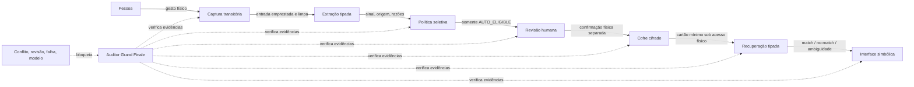

# Grand Finale de memória — composição verificável, incerteza explícita e passagem à bancada

**Passo 8 de 8 · HERUS-M8-001 · integração host, não resultado físico nem produto autônomo**

> O Núcleo não se torna um “segundo cérebro” porque cada módulo isolado compila. Ele só avança para a primeira integração física quando a cadeia inteira recusa estados ausentes, contraditórios ou inseguros, e quando cada limite ainda não medido permanece visível.

O Grand Finale fecha a primeira série de memória seletiva. Ele não acrescenta ASR, busca em linguagem natural, LLM, envio, telemetria pessoal ou armazenamento real de múltiplas memórias. Em vez disso, ele conecta os contratos já implementados em uma fixture adversarial de ponta a ponta e introduz um auditor puro que torna as premissas da composição explícitas e falsificáveis.

| Artefato | Responsabilidade | Limite deliberado |
|---|---|---|
| `core/memory_finale.[ch]` | Audita evidências tipadas de captura, extração, política, revisão, cofre, recuperação e apresentação. | Não recebe texto, candidato, cartão, cofre, chave, rádio, rede, modelo ou callback de ação. |
| `core/test_memory_finale.c` | Executa uma cadeia de fixture com captura, extração, política, consolidação, cofre RAM, recuperação e apresentação. | Não é ASR, NVS, secure element, sensor, UI física, índice de memória real ou estudo de pessoas. |
| `make memory-finale` | Compila a composição em C11 estrito e executa cenários adversariais determinísticos. | Não mede desempenho, energia, latência, acessibilidade ou compreensão. |
| `prove.sh` | Eleva o ledger a 25 suítes e 59 invariantes de prova. | Mantém as 74 invariantes do simulador como evidência independente de comunicação, não de memória pessoal. |

## 1. Cadeia de menor privilégio

Cada módulo possui apenas a autoridade necessária para sua tarefa. Nenhuma saída se transforma em permissão implícita para uma camada posterior. O auditor final consome **evidência booleana canônica**, não objetos vivos, e seu resultado `chain_consistent` é diagnóstico: não autoriza escrita, recuperação, apresentação, remoção, transmissão ou ação.



A composição materializa o princípio de engenharia de sistemas seguros do NIST SP 800-160: requisitos, arquitetura, integração, verificação e validação precisam formar uma disciplina ao longo do ciclo de vida, em vez de uma coleção de promessas de componentes [1]. No HERUS, a consequência prática é simples: uma camada pode produzir somente o tipo que a próxima camada espera; ela não recebe objeto de autoridade adicional.

## 2. Snapshot de composição e precedência

`memory_finale_snapshot_t` carrega doze observações mínimas: evidência de captura física validada, extração tipada, disposição de política, revisão humana, conflito, cofre selado, acesso/reposta de recuperação, acesso/one-shot/contrato de apresentação e presença de modelo no caminho. Booleans precisam ser exatamente `1`; qualquer outro valor é inseguro. `policy_disposition` e `retrieval_status` são enums fechados.

| Situação atacada | Resultado executável | Por que domina |
|---|---|---|
| Sem gesto físico canônico ou extração tipada | `FAIL_CAPTURE` ou `FAIL_EXTRACTION`; auditor bloqueia. | Conteúdo não é entrada autorizada só porque existe. |
| Política `DISCARD` ou `REVIEW` | `FAIL_POLICY`; auditor bloqueia. | Relevância/risco não são superados por confirmação posterior. |
| Sem confirmação humana de revisão | `FAIL_HUMAN_REVIEW`; auditor bloqueia. | Candidato elegível não equivale a memória persistida. |
| Conflito de consolidação | `FAIL_CONFLICT`; confirmação não sela cartão. | O sistema não escolhe entre registros incompatíveis. |
| Cofre ausente ou falho | `FAIL_VAULT`; auditor bloqueia. | Um “sucesso” sem cartão selado é falso. |
| Acesso ausente ou estado inválido de recuperação | `FAIL_RETRIEVAL_ACCESS`/`FAIL_RETRIEVAL_STATE`. | Recuperar não é enumeração livre. |
| Apresentação sem acesso, sem one-shot ou malformada | Falhas de apresentação; auditor bloqueia. | UI não é detalhe permissivo depois da decisão. |
| `AMBIGUOUS` corretamente apresentado | Cadeia pode ser consistente, mas nenhum vencedor aparece. | Incerteza é uma saída válida, não lacuna a ser completada. |
| Modelo presente no caminho de memória | `FAIL_MODEL_AGENCY`; auditor bloqueia. | Modelo não grava, não escolhe, não confirma e não apresenta em nome da pessoa. |

A separação de papéis e a documentação de limites de saída são coerentes com a orientação do NIST AI RMF para incorporar confiabilidade no desenho, desenvolvimento, uso e avaliação de sistemas com IA [2]. Isso não qualifica qualquer modelo futuro como seguro; proíbe-o da cadeia atual.

## 3. Cenário composto provado em host

A suíte não simula uma conversa real. Ela usa uma fixture de gramática já aprovada — uma ideia explícita, própria e ordinária — e a percorre por módulos reais em C11:

1. uma sessão de captura física limitada é iniciada;
2. a extração devolve candidato tipado e sem texto;
3. a política retorna `AUTO_ELIGIBLE` sem persistir;
4. a consolidação recebe uma proposta mínima e exige confirmação física da mesma sessão;
5. o cofre de fixture RAM sela o cartão com geração monotônica;
6. recuperação tipada sob acesso físico encontra o único cartão;
7. a interface produz `MATCH_AVAILABLE` sem `card_id` ou conteúdo;
8. o auditor final confirma a coerência da evidência, mas não emite comando.

A mesma suíte prova caminhos negativos. Terceiro sensível permanece `REVIEW` e é recusado pela consolidação; conflito bloqueia confirmação e não sobrescreve a geração do cofre; ambiguidade recebe status de revisão sem contender; resultado de apresentação não verificado bloqueia; modelo no caminho e booleano físico não canônico bloqueiam.

| Evidência no host | Afirmação permitida | Afirmação ainda proibida |
|---|---|---|
| 25 suítes e 59 invariantes de prova passam | Os contratos C11 e os cenários de fixture executados recusam os estados testados. | Que uma pessoa entendeu os sinais, que o Núcleo funciona no ESP32-S3 ou que uma memória pessoal real foi preservada. |
| Cofre RAM da fixture sela cartão mínimo | A interface do cofre pode ser exercitada em fluxo composto. | Que raiz, NVS, eFuse, secure element, power-loss ou apagamento físico foram integrados. |
| Apresentação simbólica gera plano háptico limitado | A camada portátil não expõe vencedor em ambiguidade e não repete status silenciosamente. | Que voz/vibração/tela funcionam, são acessíveis ou têm boa UX. |
| Simulador mantém 74 invariantes | A simulação de comunicação continua sem regressão. | Que alcance, energia, PDR, interferência ou privacidade física de rádio foram medidos para esta memória. |

A preocupação de manter somente os dados necessários em cada fronteira também segue o objetivo do NIST Privacy Framework de identificar e gerir risco de privacidade no desenvolvimento de produtos e serviços [3]. A composição não cria log de áudio, transcrição, embedding, identidade, localização, chave, cartão ou resultado de recuperação.

## 4. O que este Grand Finale não faz

A composição não transforma uma única fixture RAM em banco de memória pessoal. Atualmente o cofre portátil modela um registro ativo e uma porta de armazenamento opaca; indexação multi-cartão, retenção temporal, recuperação sobre conjunto persistente e migração ainda exigem desenho e backend próprios. Tampouco há ASR, LLM, busca livre, base externa, Bluetooth, Wi-Fi, nuvem, envio de HCP, fala sintetizada, tela, motor háptico, botão físico ou relógio confiável conectados a esta cadeia.

A palavra “finale” encerra a **série host de contratos de memória**, não o projeto físico. O caminho seguinte é evidência, não capacidade nova: implementar backend protegido e testes de perda de energia; adaptar gesto, confirmação e acesso; testar voz/háptica/tela com protocolo pré-registrado; medir energia e latência; e somente então decidir se uma camada local de linguagem natural merece uma fronteira independente e perfil de hardware.

## 5. Gates para primeira integração do Núcleo

| Gate pendente | Evidência mínima que falta | Decisão limitada que poderá permitir |
|---|---|---|
| Raiz/NVS/anti-rollback alvo | Porta ESP32-S3, provisão, reset, power-loss e rollback adversarial. | Afirmar somente que o backend específico foi exercitado. |
| Captura e confirmação física | Esquema, adaptador, eventos de falha, repetição e log privado. | Usar o gesto declarado como fonte do contrato de sessão. |
| Interface de recuperação | Driver/UX para voz, motor ou tela; protocolo de segurança e acessibilidade. | Apresentar somente o sinal testado na população/condição documentada. |
| Avaliação humana | Pré-registro, tarefas, medidas de compreensão de match/no-match/ambiguidade, critérios de parada e privacidade. | Reportar resultado apenas do protocolo e amostra observados. |
| Energia e latência | Instrumento, método, p95, trilha de carga e versão de firmware. | Reportar consumo/latência nas condições medidas. |
| Modelo local futuro | Pesos identificados, perfil no alvo, limites, ameaças e fronteira sem escrita. | Habilitar exclusivamente a configuração aceita, sem poder no cofre. |

> **Stop/go obrigatório:** se qualquer teste host falhar, não integrar no alvo. Se a raiz ou o piso de geração não sobreviverem ao teste de power-loss, não chamar o cofre de persistente. Se pessoas confundirem ausência com certeza ou ambiguidade com escolha, não aumentar autonomia: revise a interface e repita o protocolo. Se um modelo tentar entrar no caminho de memória, bloqueie a integração antes de avaliar sua qualidade.

## 6. Reprodução

```bash
cd firmware
make memory-finale
cd ..
git diff --check
./prove.sh --quiet
python3 tools/readiness_audit.py research/hardware_readiness_manifest.json --strict
```

O primeiro comando prova somente a composição de fixture. O último comando preserva os gates físicos gerais já congelados; ele não marca nenhum dos gates de memória acima como concluído.

## Referências

[1] National Institute of Standards and Technology, *SP 800-160 Vol. 1 Rev. 1: Engineering Trustworthy Secure Systems*. [Publicação oficial](https://csrc.nist.gov/pubs/sp/800/160/v1/r1/final).

[2] National Institute of Standards and Technology, *Artificial Intelligence Risk Management Framework*. [Página oficial](https://www.nist.gov/itl/ai-risk-management-framework).

[3] National Institute of Standards and Technology, *Privacy Framework*. [Página oficial](https://www.nist.gov/privacy-framework).
