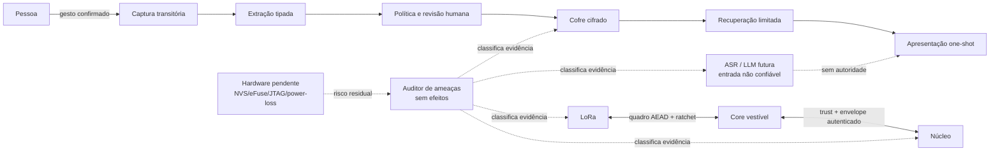

# Modelo de ameaças executável — evidência host, risco residual e limites de autoridade

**Passo 1 pré-hardware · HERUS-T9-001 · contrato host, não auditoria independente nem certificação**

> Uma ameaça não se torna mitigada porque existe um comentário, um diagrama ou um enum. No HERUS, a classificação só pode dizer **mitigada em host** quando a evidência tipada exigida para aquele vetor está completa e canônica. Hardware ainda não testado e escopo ainda não implantado permanecem visíveis como tais.

Este documento transforma a fronteira de ameaças do HERUS em um artefato verificável. Ele organiza os riscos de comunicação, trust Core↔Núcleo, memória seletiva, recuperação, telemetria, IA futura, plataforma física e cadeia de suprimentos. A implementação `firmware/core/threat_model.[ch]` é deliberadamente um **auditor puro**: ela não é monitor de produção, serviço de segurança, motor de risco, cliente de rádio, cofre, telemetria ou componente de IA.

| Artefato | Papel | O que deliberadamente não faz |
|---|---|---|
| `threat_model.h` | Tipos fechados para ameaça, evidência, falha e snapshot de controles. | Não expõe chave, pacote, cartão, candidato, texto, áudio, transcrição, embedding, identidade, localização, modelo ou callback. |
| `threat_model.c` | Exige evidência canônica por vetor e classifica o resultado fail-closed. | Não observa runtime, não calcula probabilidade/impacto, não persiste, não envia e não autoriza ação. |
| `test_threat_model.c` | Falsifica perda de controle, enum/booleano inválido, metadado de rádio, plataforma, supply chain, memória e modelo. | Não é pentest, avaliação de LLM, teste de silício, análise de side-channel ou estudo de pessoas. |
| `make threat-model` | Compila a suíte em C11 estrito. | Não substitui as provas dos módulos que fornecem os controles. |

## 1. Método e fronteiras

O método parte de ativos e fluxos de autoridade, não de uma lista genérica de controles. Essa abordagem é consistente com a definição de modelagem de ameaças centrada em dados do NIST SP 800-154: modelar aspectos de ataque e defesa para entidades lógicas selecionadas, como dados, aplicação, host, sistema ou ambiente [1]. O NIST SP 800-30 situa ameaça, vulnerabilidade, controle e risco residual dentro de avaliação de risco; esta etapa usa essa estrutura, mas não inventa probabilidades ou impactos numéricos sem observação de ambiente [2].



| Classe de evidência | Significado estrito | Consequência no auditor |
|---|---|---|
| `MITIGATED_HOST` | Todos os controles exigidos para aquele vetor foram fornecidos como `1` canônico no snapshot e a suíte correspondente mantém os cenários declarados. | `host_mitigated = 1`; isto não extrapola para silício, ambiente, operador ou adversário não modelado. |
| `PENDING_TARGET` | Falta evidência de controle, o snapshot é inconsistente ou o vetor depende de integração/medida no alvo. | Nenhuma mitigação host é emitida; as falhas explicitam a fronteira ausente. |
| `OUT_OF_SCOPE` | A propriedade não está implementada como defesa do HERUS atual. | Nenhuma mitigação é emitida; o escopo não pode ser confundido com proteção. |

## 2. Ativos, atores e pressupostos

| Ativo | Por que é sensível | Principal fronteira atual |
|---|---|---|
| Estado/segredo de sessão e quadro de rádio | Confidencialidade, integridade, replay e custo de processamento. | AEAD, ratchet, contadores, rate limit e Weave em host. |
| Identidade/trust Core↔Núcleo | Associação, frescor, revogação e resposta autorizada. | Pairing físico modelado, envelope autenticado e revogação em host. |
| Sinal de memória, recibo e cartão mínimo | Retenção seletiva e reversível sem conteúdo cru. | Captura, política, consolidação, cofre, recuperação e apresentação. |
| Resultado local de recuperação | Pode induzir falsa certeza ou enumeração. | Acesso físico, consulta tipada, ambiguidade e one-shot. |
| Entrada/saída de modelo futuro | Pode tentar persuadir, injetar instrução ou escalar autoridade. | Display-only; sem memória, envio, confirmação ou decisão. |
| Métrica de produto | Pode reidentificar, revelar conteúdo ou secreto. | Schema allowlist e proibição explícita de dados pessoais/sigilosos. |
| Flash, RAM, debug e backend alvo | Comprometimento físico, rollback e queda de energia. | **Ainda pendente** de eFuse, NVS, JTAG, power-loss e bancada. |

| Ator | Capacidade assumida | Afirmação que o HERUS não faz |
|---|---|---|
| Observador de rádio | Registra transmissão, tempo aproximado e RF. | Não se afirma ocultar presença, posição aproximada ou direction finding. |
| Atacante remoto ativo | Injeta, repete, adultera e faz flooding. | Não se afirma disponibilidade contra jamming. |
| Par/Núcleo comprometido | Emite observação inválida, vencida ou pós-revogação. | Não se afirma que trust host impede comprometimento físico do par. |
| Pessoa com dispositivo | Tenta ler RAM/flash, debug, reset, downgrade e extração física. | Não se afirma proteção antes da integração e testes de plataforma. |
| Adaptador/relógio/RNG defeituoso | Fornece evidência de sessão, tempo ou armazenamento inconsistente. | Não se afirma que interface física obedece ao contrato sem backend alvo. |
| ASR, LLM ou conteúdo persuasivo | Produz texto/áudio hostil, ambíguo ou enganoso. | Não se afirma verdade, alinhamento ou entendimento; apenas ausência estrutural de autoridade. |
| Build/dependência comprometida | Altera fonte, vetor, ferramenta ou configuração. | Digest local só detecta divergência de insumo declarado; não se afirma checkout autenticado, SBOM completo, assinatura, SLSA ou auditoria de supply chain. |

## 3. Matriz de ameaças e rastreabilidade

| ID | Vetor e ativo | Controle host requerido | Evidência executável atual | Classe honesta | Risco residual/gate |
|---|---|---|---|---|---|
| TM-01 | Injeção, mutação, replay e custo contra rádio/sessão. | AEAD, replay recusado, rate limit e flooding limitado. | `test_net.c`; invariante `Threat model ... complete canonical evidence`. | `MITIGATED_HOST` | Jamming, RF físico e implementação alvo permanecem fora desta classe. |
| TM-02 | Tráfego, presença e correlação de rádio. | Airtime constante é evidência parcial. | `test_net.c`; `radio_constant_airtime`. | `OUT_OF_SCOPE` | Presença de transmissão, direção e localização aproximada não são ocultadas. |
| TM-03 | Pareamento, envelope vencido ou pós-revogação Core↔Núcleo. | Pairing, autenticação, frescor e revogação dominantes. | `test_trust.c`, `test_core_link.c`. | `MITIGATED_HOST` | Transport, RNG, armazenamento e revogação no alvo continuam pendentes. |
| TM-04 | Retenção sem consentimento, terceiro/sensível, rollback, duplicata, capacidade, transação contraditória, replay de acesso ou composição que contorne confirmação humana. | Captura física, política, autoridade humana, cofre/coleção autenticados, geração, revisão, conflito, capacidade fixa, commit estrito, oráculo de promoção/descarte/finalização, sessão de propósito/validade/consumo em RAM, recuperação canônica de marcador e bootstrap em quarentena que importa apenas piso sem reativação, composição M14 sem auto-open/fallback/modelo. | `test_memory_*`, `test_memory_collection.c`, `test_memory_collection_recovery.c`, `test_memory_collection_finale.c`, `test_memory_physical_session.c`, `test_memory_physical_session_recovery.c`, `test_memory_physical_session_bootstrap.c` e `test_threat_model.c`. | `MITIGATED_HOST` | Evento humano, nonce/tempo no alvo, autenticação e persistência de marcador, reset/RAM físicos, resistência real a replay pós-reboot, NVS, raiz, equivalência de autorização entre backends, durabilidade de callback, power-loss/brownout, apagamento físico, endurance e backend multi-cartão no alvo não são provados. |
| TM-05 | Enumeração, seleção indevida e falsa certeza na recuperação unitária ou multi-cartão. | Acesso físico, query tipada não vazia, orçamento de sonda, ambiguidade preservada, ausência de abertura automática, ausência de fallback e apresentação one-shot. | `test_memory_retrieval.c`, `test_memory_collection_index.c`, `test_memory_collection_finale.c`, `test_memory_retrieval_present.c`. | `MITIGATED_HOST` | Relevância humana, interface real, voz, háptica, tela, acessibilidade, vazamento de acesso, PIR/ORAM e recuperação em corpus maior permanecem pendentes. |
| TM-06 | Modelo/ASR obtendo poder sobre memória ou transmissão. | Display-only, sem autoridade de memória e sem autoridade de envio, inclusive na composição multi-cartão. | `test_model_lab.c`, `test_dialogue.c`, `test_memory_finale.c`, `test_memory_collection_finale.c`, `test_threat_model.c`. | `MITIGATED_HOST` | Não há modelo local avaliado; não se afirma robustez semântica ou resistência completa a prompt injection. |
| TM-07 | Telemetria contendo conteúdo, dado pessoal ou segredo. | Métrica numérica permitida e campos proibidos ausentes. | Manifesto de readiness, `test_interactionlog.sh`, `test_threat_model.c`. | `MITIGATED_HOST` | Operação futura deve manter schema, revisão e privacidade dos adaptadores. |
| TM-08 | Comprometimento físico, debug, flash, NVS e power-loss. | Evidência de secure boot, flash encryption, JTAG-off, NVS e teste de queda. | Nenhuma evidência de alvo; auditor devolve pendência mesmo se flags forem injetadas. | `PENDING_TARGET` | Gate de plataforma e procedimento em placa sacrificial. |
| TM-09 | Comprometimento de build, ferramenta ou dependência. | Manifesto local canonical, digests de insumos declarados, inventário direto, campos sensíveis ausentes e gates explícitos. | `test_provenance_audit.py`, `provenance_audit.py` e `test_threat_model.c`. | `PENDING_TARGET` | Falta autenticidade de checkout/builder, assinatura, SBOM completo, isolamento, reprodução independente, artefato alvo e auditoria. |

A classificação `MITIGATED_HOST` é propositalmente estreita. Por exemplo, o protocolo possui AEAD e testes diferenciais, mas o próprio `SECURITY.md` declara que chaves de sessão ficam em RAM legível até secure boot, flash encryption e JTAG-off no alvo. O auditor não tem permissão semântica para transformar uma flag de teste em propriedade física.

## 4. Contrato C11 e falha fechada

A única operação pública é:

```c
int threat_model_assess(threat_model_threat_t threat,
                        const threat_model_snapshot_t *snapshot,
                        threat_model_decision_t *out);
```

A função recebe uma ameaça fechada e um snapshot de booleans de controle. Cada boolean precisa ser exatamente `0` ou `1`. Valor `2`, enum inválido, `NULL` ou evidência exigida ausente impede classificação positiva. O snapshot contém apenas estado de controle, não dados de produto.

| Propriedade testada | Contraprova executada |
|---|---|
| Rádio ativo não recebe sucesso parcial. | Remover replay bloqueia TM-01 mesmo com AEAD, rate limit e flood bound presentes. |
| Memória não recebe sucesso por confirmação isolada. | Remover revisão de sensível, conflito, recuperação, composição multi-cartão, sessão vinculada, recuperação de reserva ou quarentena de bootstrap falha TM-04. |
| Recuperação não converte incerteza em UI permissiva. | Remover ambiguidade ou one-shot falha TM-05. |
| Modelo não herda poder por existir. | Remover no-memory/no-send falha TM-06. |
| Telemetria não aceita categoria proibida. | Remover `telemetry_forbidden_absent` falha TM-07. |
| Lacuna física não é “pass”. | TM-08 sempre resulta `PENDING_TARGET` em C portátil. |
| Presença de digest local não vira autenticidade. | TM-09 retorna `PENDING_TARGET` mesmo quando o digest local é válido; ausência do controle acrescenta falha específica. |
| Evidência malformada não é interpretada. | Booleano não canônico e ameaça desconhecida falham fechados. |

O perfil de IA generativa do NIST AI 600-1 orienta a incorporar considerações de confiabilidade ao desenho, desenvolvimento, uso e avaliação de sistemas de IA generativa [3]. O HERUS traduz isso em uma fronteira concreta, não em uma alegação de alinhamento: qualquer camada futura de ASR/LLM pode produzir uma apresentação local somente se continuar estruturalmente incapaz de reter, enviar, confirmar ou agir.

## 5. Reprodução e próximos gates

```bash
cd firmware
make threat-model
cd ..
git diff --check
./prove.sh --quiet
python3 tools/readiness_audit.py research/hardware_readiness_manifest.json --strict
python3 tools/provenance_audit.py research/software_provenance_manifest.json --strict
cd firmware && make memory-collection-finale && make memory-physical-session && make memory-physical-session-recovery && make memory-physical-session-bootstrap
```

Com os passos posteriores de coleção, índice, recuperação, composição multi-cartão, sessão de propósito e proveniência local, o pipeline executa **34 suítes**, **77 invariantes de prova** e mantém as **74 invariantes de sistema simulado**. Esses números são evidência de cenários exercitados em host, não estimativa de probabilidade de comprometimento nem métrica de segurança física.

A próxima decisão de engenharia deve usar esta matriz para priorizar o adaptador alvo da coleção e a matriz de cortes controlados em `PREPARED`/piso/`COMMITTED`/limpeza/boot-quarantine, a equivalência real da autorização entre cofre e coleção e a UX que preserva `NO_MATCH`/`AMBIGUOUS` e o adaptador de evento/nonce/tempo/piso de sessão resistente a reset; em paralelo, deve preparar atestação assinada, inventário de release, toolchain/build controlados e comparação independente de artefato sem perder os gates de secure boot, flash encryption, JTAG-off, NVS/raiz, RNG, transport, instrumentos de energia, interface física e avaliação humana. Uma ameaça marcada pendente só pode ser reclassificada com evidência correspondente, não com documentação adicional.

## Referências

[1] National Institute of Standards and Technology, *SP 800-154 (Initial Public Draft): Guide to Data-Centric System Threat Modeling*. [Publicação oficial](https://csrc.nist.gov/pubs/sp/800/154/ipd).

[2] National Institute of Standards and Technology, *SP 800-30 Rev. 1: Guide for Conducting Risk Assessments*. [Publicação oficial](https://csrc.nist.gov/pubs/sp/800/30/r1/final).

[3] National Institute of Standards and Technology, *AI 600-1: Artificial Intelligence Risk Management Framework: Generative Artificial Intelligence Profile*. [Publicação oficial](https://www.nist.gov/publications/artificial-intelligence-risk-management-framework-generative-artificial-intelligence).
