# Coleção de memória — cartões mínimos multi-cartão, transação e recuperação estrita

**Passo 2 pré-hardware · HERUS-T10-001 · contrato portátil C11, não backend físico certificado**

> Uma coleção não é uma permissão para registrar mais da vida da pessoa. Ela é somente uma forma limitada de manter **até oito cartões mínimos já autorizados**, sem texto livre, sem autonomia e sem transformar erro de armazenamento em sucesso.

Este passo evolui o cofre unitário para uma coleção de cartões tipados. O cofre continua definindo o cartão mínimo e suas fronteiras de autoridade; a coleção adiciona índice autenticado, capacidade fixa, transação `PREPARED`→`COMMITTED`, piso monotônico de coleção, remoção lógica e compactação canônica. Não integra NVS, ESP-IDF, eFuse, secure element, flash, filesystem, endereço físico ou chamada de modelo na API pública.

| Artefato | Responsabilidade | Deliberadamente ausente |
|---|---|---|
| `memory_collection_store.h` | Porta opaca para registro preparado, registro confirmado e piso de geração. | Tipo de NVS, endereço de flash, setor, chave, nonce, texto ou cartão em claro. |
| `memory_collection.h` | Estados, acesso físico já canônico, operações e métricas numéricas. | Candidato, ASR, diálogo, rádio, rede, LLM, identidade, localização e timestamp. |
| `memory_collection.c` | Serialização canônica, HKDF, AEAD, transação, recuperação e bloqueio. | Alocação dinâmica, busca, enumeração, deduplicação semântica, resolução de conflito ou sanitização física. |
| `test_memory_collection.c` | Backend RAM e contraprovas de autoridade, integridade, capacidade, transação e rollback. | Persistência real, endurance, power-loss físico, ataque à RAM/flash ou proteção de silício. |

## 1. Posição na cadeia humana de memória

A coleção recebe somente `memory_vault_card_t` que já passam a política conservadora do cofre: sessão autorizada, escopo `SELF`, sensibilidade `ORDINARY`, origem conhecida, razões não vazias e disposição `AUTO_ELIGIBLE`. Além disso, inserir exige a autorização vinculada a `card_id` e `review_receipt_id`, e uma asserção física canônica. Acesso físico isolado **não** substitui autorização de escrita; autorização isolada **não** substitui o acesso físico da operação.

| Fluxo | Pré-condição | Efeito permitido |
|---|---|---|
| Inserir | Cartão válido + autorização humana vinculada + acesso físico. | Acrescentar um cartão a coleção, se houver capacidade. |
| Abrir por ID | ID opaco conhecido + acesso físico. | Devolver somente o cartão mínimo solicitado; nunca enumerar todos. |
| Remover | ID opaco existente + acesso físico. | Retirar referência ativa logicamente e avançar geração. |
| Compactar | Acesso físico + coleção íntegra. | Reordenar cartões existentes pelo ID opaco; não mudar campos nem significado. |
| Recuperar na inicialização | Registros autenticados e relação de geração não ambígua. | Promover a intenção já íntegra ou bloquear. |

Nenhuma dessas operações cria um cartão, interpreta uma frase, decide relevância, escolhe entre conflitos, gera resumo, chama modelo ou transmite informação. A compactação não é “memória inteligente”: ela só reordena slots tipados e não pode mesclar ou deduplicar significado.

## 2. Formato e minimização de dados

A capacidade fixa é **8 cartões**. A coleção usa um blob opaco de **272 B**, composto por cabeçalho autenticado, payload cifrado de oito slots, tag AEAD integral e reserva canônica zero.

| Parte | Tamanho | Proteção | Conteúdo lógico |
|---|---:|---|---|
| Cabeçalho/AAD | 28 B | Integridade AEAD | Versão, estado transacional, contagem, `collection_id`, geração, geração-base e nonce canônico. |
| Payload | 224 B | Confidencialidade + integridade AEAD | Oito slots de 28 B: `card_id` opaco + cartão mínimo serializado. |
| Tag | 16 B | Autenticação integral | ChaCha20-Poly1305, sem truncamento. |
| Reserva | 4 B | Regra canônica | Sempre zero; bytes desconhecidos são recusados. |

O slot não contém áudio, texto, transcrição, resumo, embedding, identidade, localização, timestamp, chave, nonce em claro ou histórico de captura. Ele armazena `card_id`, recibo opaco de revisão, sinal tipado, origem e razões tipadas; esse formato é revalidado depois da decriptação. Structs C não são persistidas diretamente, evitando dependência de padding ou ABI.

## 3. Derivação e autenticação

| Elemento | Regra | Finalidade |
|---|---|---|
| Raiz | 32 B por adaptador privado `memory_collection_platform_load_root`. | Nunca aparece em tipo público, blob, métrica, log ou fixture de produto. |
| Sal HKDF | `collection_id || generation`. | Separação por contexto e por versão da coleção. |
| Informação HKDF | `HERUS/MEMORY-COLLECTION/v1`. | Separação de domínio do cofre unitário. |
| Chave | 32 B por geração. | Evita reutilizar par chave/nonce entre transações. |
| Nonce | `HMC1 || collection_id || generation`. | Valor canônico de 12 B, derivado e autenticado. |
| AAD | Cabeçalho de 28 B. | Vincula versão, estado, contagem, contexto, geração/base e nonce. |

A recomendação NIST SP 800-57 Part 1 trata a gestão e proteção de material criptográfico como requisito de ciclo de vida, não como dado comum [1]. A coleção aplica essa orientação em software: raiz e derivada são carregadas temporariamente e zeroizadas; porém, esse comportamento host não prova ausência de remanência em registradores, cache, RAM externa ou mídia real.

## 4. Máquina de transação e recuperação

A atualização é deliberadamente ordenada para que uma falha não seja convertida em sucesso. A portabilidade está na porta opaca; cada backend precisa demonstrar que seu `commit_generation_floor()` não aceita redução e que sua confirmação é apropriada ao ambiente escolhido.

| Etapa | Escrita | Resultado se falhar |
|---|---|---|
| 1. Preparar | Serializar/cifrar candidato `PREPARED` em geração `g + 1`, com base `g`. | Coleção bloqueada; nenhum sucesso. |
| 2. Ancorar | Confirmar piso monotônico `g + 1`. | Coleção bloqueada; registro preparado permanece para decisão de recuperação. |
| 3. Confirmar | Serializar/cifrar a mesma coleção em estado `COMMITTED`. | Coleção bloqueada; uma reabertura pode promover somente a intenção autenticada não ambígua. |
| 4. Limpar | Remover o registro preparado. | Coleção bloqueada; reabertura confirma coerência entre preparado e confirmado antes de limpeza. |

Na inicialização, três casos são válidos: ambos os registros ausentes com piso zero; somente um registro confirmado cuja geração coincide com o piso; ou um registro preparado autenticado, de geração igual ao piso e coerente com o confirmado/estado-base. Qualquer contador regressivo, registro alterado, contagem inválida, duplicata, slot não canônico, transação contraditória, callback com falha ou relação de gerações não demonstrável bloqueia a coleção.

```mermaid
stateDiagram-v2
    [*] --> Empty: floor=0; committed/prepared absent
    Empty --> Ready: init
    Ready --> Prepared: mutação humana válida
    Prepared --> Anchored: piso g+1 confirmado
    Anchored --> Committed: registro COMMITTED autenticado
    Committed --> Ready: PREPARED limpo
    Prepared --> Recover: reinicialização
    Anchored --> Recover: reinicialização
    Recover --> Ready: intenção autenticada e não ambígua
    Prepared --> Blocked: erro ou contradição
    Anchored --> Blocked: erro ou contradição
    Committed --> Blocked: limpeza falha
    Ready --> Blocked: I/O, AAD/tag, rollback, tipo inválido
```



A biblioteca NVS do ESP-IDF é um **candidato** de adaptador, não uma garantia já herdada pelo HERUS. A documentação descreve armazenamento key-value log-estruturado, tentativa de recuperação após estado inconsistente e a possibilidade de perda do par em escrita durante power-off; também descreve riscos adicionais com energia instável e verificação de erase opcional [2]. Por isso, o contrato host não afirma atomicidade de NVS, segurança de power-loss ou recovery físico.

## 5. Ameaças, recusas e provas host

| Evento adversarial | Resultado testado | Limite preservado |
|---|---|---|
| Acesso físico não canônico | Inserção, abertura, remoção e compactação recusadas. | Não prova que botão/gesto físico seja autêntico. |
| Autorização ausente ou não vinculada | Inserção recusada. | Não prova UX humana real. |
| Cartão sensível, terceiro, inválido ou malformado | Inserção recusada antes de cifrar. | Não classifica fala real; recebe cartão já tipado. |
| ID duplicado | Recusado; nenhum overwrite ou merge. | Não resolve conflito semântico entre cartões distintos. |
| Capacidade cheia | Recusada; nenhum eviction/sobrescrita automática. | Não mede capacidade final de produto. |
| Tag, AAD, nonce/reserva ou payload alterados | Decriptação/validação falha e coleção bloqueia. | Não mede side-channel ou extração física. |
| Falha em prepare, floor, commit ou cleanup | Não retorna sucesso; estado bloqueado. | Não prova comportamento de driver/flash em bancada. |
| Preparado válido após commit parcial | Reabertura promove apenas o estado autenticado/coerente. | Não deve ser lido como recuperação geral de quedas de energia. |
| Blob confirmado antigo com piso novo | `E_ROLLBACK` e bloqueio. | Depende de âncora realmente durável e não redutível. |
| Remoção | Remove referência ativa logicamente e avança geração. | Não é sanitização nem prova de bytes removidos da mídia. |

A suíte `make memory-collection` usa um backend RAM exclusivamente de fixture e exerce fluxo autorizado, capacidade, cartão sensível, duplicidade, acesso inválido, remoção, compactação, falha após piso, recuperação, rollback, tag alterada e falha de raiz. O pipeline total passa a ter **27 suítes**, **63 invariantes de prova** e mantém **74 invariantes do simulador**. Isso é evidência de código host para esses cenários, não medição de silício, energia, RF, UX, ASR ou modelo.

## 6. Exclusão, compactação e linguagem honesta

A exclusão é chamada **lógica**. A coleção deixa de referenciar o cartão no registro confirmado, mas cópias anteriores podem continuar no backend até seu mecanismo próprio de coleta/purge. A compactação apenas ordena IDs opacos e regrava a coleção por transação; não é purge e não altera o significado de cartão algum.

A documentação atual de NVS informa que atualizações/erases convencionais podem marcar dados como apagados na metadata enquanto valores permanecem em flash, e oferece mecanismos de purge com custo adicional de escrita [2]. Caso um adaptador futuro use tais recursos, a PR correspondente deve especificar versão, configuração, procedimento, desgaste e testes. Mesmo então, afirmações sobre remanência dependerão de mídia, ameaça e avaliação física.

## 7. Portabilidade e critérios de escolha de plataforma

O HERUS não fica preso ao ESP32-S3. A porta foi escrita para suportar um MCU com armazenamento protegido integrado, um MCU mais simples combinado a secure element, um coprocessador de segurança, um armazenamento dedicado ou uma arquitetura separada entre rádio e Núcleo. Nenhuma alternativa é aprovada sem evidência.

| Critério de escolha | Evidência exigida antes da escolha | Pergunta que evita autoengano |
|---|---|---|
| Raiz de confiança | Provisão revisável, isolamento de chave e recuperação/revogação documentadas. | Onde a raiz realmente vive e quem pode extraí-la? |
| Inicialização e debug | Secure boot, política de debug/download e cadeia de atualização. | Firmware não autorizado ainda pode ler/alterar a coleção? |
| Confidencialidade/integridade persistente | Mapeamento da porta para chave, AEAD/armazenamento e autenticação de índices. | Alteração, cópia e rollback são detectados no sistema escolhido? |
| Semântica de commit | Teste de interrupção em cada fase `PREPARED`/piso/`COMMITTED`/cleanup. | O que ocorre com power-loss real, inclusive em erase? |
| Exclusão | Descrição de exclusão lógica, purge disponível e limites de mídia. | O que foi removido de fato e o que só perdeu referência? |
| Recursos | Medição de RAM, flash, energia, latência, boot e endurance no perfil real. | Cabe no Núcleo sem comprometer rádio e interação? |
| Ferramentas e longevidade | SDK mantido, debug seguro, reprodutibilidade, disponibilidade e plano de atualização. | A segurança continuará auditável e fabricável? |
| Avaliação adversarial | Plano de testes de downgrade, replay, reflash, cold boot, debug e corrupção. | Quais propriedades foram medidas, e quais ainda são hipótese? |

O ESP32-S3 continua uma opção concreta: o ESP-IDF documenta NVS Encryption por Flash Encryption ou por chave HMAC em eFuse, e declara que NVS cifrada não é resistente a erase [3]. Isso é útil para planejar um adaptador, mas não cria exclusividade nem resolve todos os critérios da tabela. A escolha final deverá ser um gate de engenharia comparativo, não uma consequência automática do primeiro protótipo.

## 8. Reprodução e continuidade

```bash
cd firmware
make memory-collection
cd ..
git diff --check
./prove.sh --quiet
```

O [índice privado da coleção](27-INDICE-PRIVADO-COLECAO.md) agora faz recuperação tipada, limitada e abstencionista sobre a coleção em RAM transitória, mas não abre cartão automaticamente nem muda a autoridade humana. A coleção e seu índice ainda não são conectados ao auditor `memory_finale`; essa integração será uma decisão explícita de passo posterior, depois de definir como o fluxo humano seleciona coleção e como o Grand Finale deve distinguir cofre unitário legado da coleção. Não há fallback silencioso entre os caminhos.

## Referências

[1] National Institute of Standards and Technology, *SP 800-57 Part 1 Rev. 5: Recommendation for Key Management — Part 1: General*. [Publicação oficial](https://csrc.nist.gov/pubs/sp/800/57/pt1/r5/final) e [DOI](https://doi.org/10.6028/NIST.SP.800-57pt1r5).

[2] Espressif Systems, *Non-Volatile Storage Library — ESP32-S3, ESP-IDF Programming Guide*. [Documentação oficial](https://docs.espressif.com/projects/esp-idf/en/stable/esp32s3/api-reference/storage/nvs_flash.html).

[3] Espressif Systems, *NVS Encryption — ESP32-S3, ESP-IDF Programming Guide*. [Documentação oficial](https://docs.espressif.com/projects/esp-idf/en/stable/esp32s3/api-reference/storage/nvs_encryption.html).
