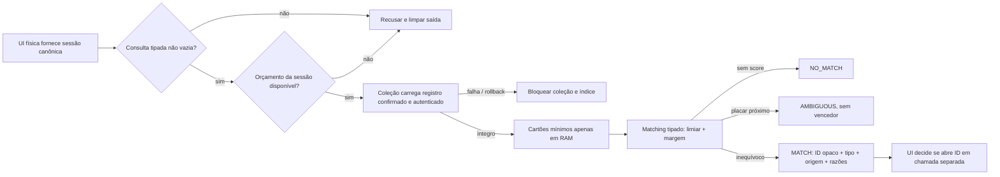

# Índice privado de coleção — recuperação multi-cartão limitada e abstencionista

**Passo 3 pré-hardware · HERUS-T11-001 · mediador C11 portátil, não mecanismo de busca geral**

> O índice do HERUS não responde perguntas e não descobre memórias. Ele só decide se uma **consulta tipada, fisicamente autorizada e limitada** tem um cartão mínimo inequivocamente compatível dentro da coleção autenticada. Na dúvida, ele se abstém.

Este passo conecta recuperação a uma coleção de vários cartões sem transformar a memória em base de texto, índice de embeddings, log de vida ou interface com autoridade. `memory_collection_index.[ch]` é um mediador em RAM: carrega a coleção autenticada apenas durante a chamada, reaproveita o matching já provado, devolve no máximo um resultado mínimo e zeroiza cartões temporários. O índice não é persistido separadamente e não adiciona NVS, filesystem, rede, modelo, ASR, LLM, banco externo ou dependência de fornecedor.

| Artefato | Responsabilidade | Deliberadamente ausente |
|---|---|---|
| `memory_collection_index.h` | Consulta tipada, orçamento por sessão física, métricas numéricas e resultado mínimo. | Texto, áudio, transcrição, embedding, identidade, localização, timestamp, chave, blob, log de consulta, API de ação ou rede. |
| `memory_collection_private.h` | Costura interna C para entregar cartões autenticados a um buffer transitório sob acesso físico. | Header de produto, listagem para UI, persistência adicional ou exportação de coleção. |
| `memory_collection_index.c` | Mediação local, cópia temporária, scoring existente, abstenção e zeroização. | Escrita, erase, compactação, abertura automática, candidato, política, modelo, rádio ou telemetria de conteúdo. |
| `test_memory_collection_index.c` | Fixture RAM e contraprovas de match, ausência, ambiguidade, orçamento, acesso, consulta e autenticidade. | Precisão em usuários reais, busca em linguagem natural, benchmark grande, latência/energia ou backend físico. |

## 1. Cadeia de autoridade

A consulta não cria nem abre uma memória. Ela fica entre a coleção e a abertura exata de um cartão.



O resultado `MATCH` não contém cartão completo e não abre a coleção. Caso a interface queira apresentar ou recuperar o cartão mínimo, ela deve invocar `memory_collection_open()` separadamente, com acesso físico canônico. Essa separação impede que um ranking se torne leitura automática.

| Operação | Exigência | Resultado permitido |
|---|---|---|
| `memory_collection_index_query()` | Sessão física canônica, consulta tipada não vazia, orçamento e coleção pronta. | `MATCH`, `NO_MATCH` ou `AMBIGUOUS`; nenhum efeito persistente. |
| `MATCH` | Score ≥ 60 e margem ≥ 10 pontos sobre concorrente. | ID opaco, tipo, origem, score e razões; não devolve cartão. |
| `NO_MATCH` | Nenhum cartão passa os filtros/limiar ou a coleção está vazia. | Sem ID, tipo, origem ou razões. |
| `AMBIGUOUS` | Concorrente elegível fica a menos de 10 pontos do topo. | Sem vencedor, sem ID, tipo, origem ou razões. |
| Abertura posterior | ID conhecido e outra chamada com acesso canônico. | Cartão mínimo exato pela coleção; continua sem conteúdo livre. |

## 2. Consulta, minimização e orçamento

A consulta é exatamente a estrutura tipada de recuperação já existente:

| Campo | Regra | Por que existe |
|---|---|---|
| `preferred_kind` | Opcional, mas ao menos um critério global é obrigatório. | Filtra classes explícitas de memória sem palavra-chave. |
| `preferred_origin` | Opcional. | Restringe a procedência tipada, não a pessoa ou local. |
| `require_explicit` | Booleano canônico. | Permite exigir o lembrete explícito sem inferir intenção. |
| `minimum_confidence_pct` | 0–100. | Estabelece um piso de qualidade de sinal já armazenada. |

Uma consulta vazia é recusada, porque funcionaria como enumeração. Consultas válidas consomem um crédito, inclusive `NO_MATCH` e `AMBIGUOUS`. O padrão é **3 consultas por sessão física**; o limite configurável vai de 1 a 8. Uma nova sessão canônica reinicia apenas o contador transitório. O índice não retém o ID da sessão, o conteúdo da consulta, o ID do resultado nem propriedades de cartão em métricas de produto.

A NIST descreve TREC como infraestrutura para avaliação de recuperação baseada em coleções de teste e metodologias de avaliação [1]. Esta implementação usa esse princípio de forma estreita: fixtures fechadas e repetíveis provam transições e recusas; elas não medem relevância humana, precisão pessoal, linguagem natural ou satisfação de usuário. A publicação NIST *Privacy in Information Retrieval* torna privacidade uma preocupação explícita para sistemas de recuperação [2], e o Privacy Framework orienta gestão de risco à privacidade durante inovação [3]. Aqui, isso se traduz em não criar um segundo arquivo de índice, não persistir consultas e não devolver competidores.

## 3. Matching e incerteza

O índice reutiliza os filtros e a pontuação determinística de `memory_retrieval`: kind, origem, explicitness, confiança, novidade, valor futuro e consequência. Filtro solicitado precisa corresponder; atributos de qualidade só contribuem com pontos ou atendem o piso. Não existe vetorização, similaridade de texto, modelo neural, interpretação probabilística livre ou resposta em linguagem natural.

| Condição | Comportamento | O que não ocorre |
|---|---|---|
| Fonte vazia | `NO_MATCH`. | Não há uma “melhor hipótese”. |
| Tipo/origem não coincide | Cartão é ignorado. | Nenhum match parcial é inventado. |
| Topo abaixo de 60 | `NO_MATCH`. | Não se revela o quase-vencedor. |
| Dois scores diferem por menos de 10 | `AMBIGUOUS`. | Não se escolhe, ordena ou expõe contender. |
| Fonte alterada, rollback, I/O ou coleção bloqueada | Índice vai para `BLOCKED`. | Não usa snapshot antigo nem tenta reparar silenciosamente. |
| Acesso não canônico | Erro e saída limpa. | Não se consome fonte, não há read. |

> O score é um mecanismo de controle determinístico para fixture tipada; **não é probabilidade, verdade, confiança humana, lembrança, relevância pessoal ou autorização**.

## 4. Costura interna e privacidade

A coleção corretamente não possui uma API pública de listagem. Para evitar contornar esse limite, `memory_collection_private.h` define uma costura interna de repositório: ela só é chamada pelo índice, requer o mesmo acesso físico canônico, carrega o registro `COMMITTED` via AEAD/piso de geração já existente e copia no máximo oito cartões para uma matriz da pilha. O índice usa a matriz, chama o matching e a zeroiza sempre antes de retornar.

A costura é disciplina de arquitetura, não defesa contra um atacante que altere firmware ou leia RAM. Secure boot, debug, raiz protegida, RAM/flash, rollback físico e inspeção de compilado continuam gates de plataforma. O modelo de ameaças trata esses riscos como `PENDING_TARGET`, não como mitigação host.

| Propriedade de privacidade | Evidência host | Limite honesto |
|---|---|---|
| Não há índice persistente separado | Estruturas de estado não têm cards, IDs ou query; somente contador de sessão e métricas numéricas. | Não prova que compilador/RAM/backend não retenham dados. |
| Não há enumeração por UI/API | Query exige filtro e retorna no máximo um ID; vazio e budget excedido são recusados. | Costura interna examina a matriz temporária para calcular ranking. |
| Não há abertura automática | Teste confirma `collection.metrics.opens` inalterado após `MATCH`. | UI física real ainda precisa ser implementada e avaliada. |
| Não há competidor em ambiguidade | Resultado limpa ID/tipo/origem/razões. | Não mede se a codificação háptica/voz será entendida. |
| Não há telemetria de conteúdo | Métricas são contadores agregados. | Schema real de produto ainda não foi integrado ao alvo. |

## 5. Escala arquitetural, não marketing de capacidade

A coleção atual limita deliberadamente a oito cartões. Portanto, o índice é O(8) por consulta e não há alegação de escala de corpus, ANN, latência, throughput, consumo ou capacidade física. A palavra “escalável” neste passo significa que a **separação de planos** existe: coleção autentica armazenamento; índice mede uma matriz temporária; interface abre um ID somente após decisão humana. Essa divisão permite trocar o backend de cartões no futuro sem conceder a ele poder sobre autorização, consulta, modelo ou apresentação.

| Alternativa futura | Condição de aceitação | Não presumido |
|---|---|---|
| MCU com armazenamento protegido | Adaptador prova raiz, commit, rollback, recovery e recursos no alvo. | Que NVS/flash do fornecedor seja automaticamente atômico ou privado. |
| Secure element + MCU simples | Root/assinatura/contadores demonstrados sob ameaça definida; interface de dados continua mínima. | Que secure element resolva confidencialidade do índice ou purgue a flash principal. |
| Coprocessador/arquitetura dividida | Canal autenticado, limite de metadados, orçamento e autoridade avaliados. | Que dividir processadores elimine ataques de side-channel ou trust. |
| Banco externo seguro | Política de conectividade, dados, disponibilidade, revogação e ameaça aprovadas pelo usuário. | Que “externo” seja compatível com off-grid ou privacidade por padrão. |
| Estrutura maior no Núcleo | Benchmark reproduzível de cardinalidade, energia, latência, memória e utilidade humana. | Que a semântica de oito cartões se generalize sem novo estudo. |

Private Information Retrieval criptográfico, ORAM, busca por embeddings e indexação neural não foram implementados. Eles exigem modelo de ameaça, custo, vazamento de acesso, corpus, avaliação e plataforma próprios. Não devem ser adicionados apenas para chamar a recuperação de “state of the art”.

## 6. Contraprovas e reprodução

A suíte `make memory-collection-index` prova em backend RAM de fixture:

| Cenário | Resultado esperado |
|---|---|
| Único cartão que atende tipo | `MATCH` mínimo, sem abrir cartão. |
| Nenhum cartão atende tipo | `NO_MATCH` sem ID ou razões. |
| Dois cartões de mesmo score | `AMBIGUOUS` sem vencedor. |
| Terceira consulta na mesma sessão (limite 2 no teste) | Erro de orçamento e saída limpa. |
| Sessão não canônica | Erro de acesso, sem leitura. |
| Query vazia | Erro de query, sem enumeração. |
| Tag de coleção alterada | Coleção e índice bloqueiam; nenhum candidato antigo é devolvido. |

```bash
cd firmware
make memory-collection-index
cd ..
git diff --check
./prove.sh --quiet
```

O pipeline passa a ter **28 suítes**, **65 invariantes de prova** e mantém **74 invariantes do sistema simulado**. Estes números são evidência do código host e dos cenários exercitados, não de um dispositivo final.

## Referências

[1] National Institute of Standards and Technology, *Text REtrieval Conference (TREC)*. [Página oficial](https://www.nist.gov/programs-projects/text-retrieval-conference-trec).

[2] Ian Soboroff, National Institute of Standards and Technology, *Privacy in Information Retrieval* (2024). [Publicação oficial](https://www.nist.gov/publications/privacy-information-retrieval).

[3] National Institute of Standards and Technology, *Privacy Framework*. [Página oficial](https://www.nist.gov/privacy-framework).
