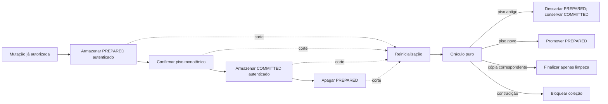

# Recuperação transacional — oráculo de interrupção, piso monotônico e falha fechada

**Passo 4 pré-hardware · HERUS-T12-001 · contrato C11 host, não prova de retenção física**

> Uma transação interrompida não autoriza uma memória nova, não justifica reutilizar um snapshot antigo e não pode ser “corrigida” por adivinhação. O HERUS só recupera uma topologia autenticada e unívoca; as demais permanecem bloqueadas.

Este passo torna explícita a decisão feita na inicialização da coleção multi-cartão. `memory_collection_recovery.[ch]` é um **oráculo puro**: recebe somente a presença autenticada de `COMMITTED` e `PREPARED`, suas gerações, a geração-base e um piso monotônico já carregado. Ele não lê armazenamento, não conhece cartão, texto, áudio, transcrição, embedding, identidade, localização, sessão, chave, blob, modelo, rede ou rádio. A coleção continua responsável por autenticar AEAD, executar I/O e falhar fechada caso qualquer operação física retorne erro.

A NIST descreve resiliência de plataforma como proteção, detecção e recuperação contra mudanças destrutivas de firmware e dados [1]. Suas orientações para armazenamento também incluem proteção de dados, isolamento, restauração, criptografia, autorização, controle de mudança e resposta/recuperação [2]. Este passo usa tais princípios em um contrato pequeno e testável; não transforma uma simulação em garantia de flash. A documentação de secure storage da NXP é um exemplo concreto — e deliberadamente não normativo para o HERUS — de contador monotônico comparado a metadados para recusar rollback [3]. No HERUS, a única suposição portátil é a porta `commit_generation_floor()`: se ela retorna sucesso, o backend deve manter o piso sem redução.

| Artefato | Responsabilidade | O que não faz |
|---|---|---|
| `memory_collection_recovery.h` | Define snapshot numérico fechado e seis ações de recuperação. | Não expõe cartão, chave, blob, callback, plataforma, log, busca ou autoridade. |
| `memory_collection_recovery.c` | Classifica uma topologia já autenticada como `EMPTY`, `USE_COMMITTED`, `PROMOTE_PREPARED`, `FINALIZE_PREPARED`, `DISCARD_PREPARED` ou bloqueio. | Não desencripta, persiste, apaga, mede energia, interpreta erro físico ou decide sobre pessoa. |
| `memory_collection.c` | Autentica cada registro, chama o oráculo e executa a ação escolhida. | Não aceita estado não autenticado, geração pulada, rollback ou limpeza ambígua. |
| `test_memory_collection_recovery.c` | Falsifica os estados seguros e contraditórios da matriz. | Não simula silício, brownout, desgaste, corrupção parcial, latência, energia ou recoverability de mídia. |
| `test_memory_collection.c` | Exercita promoção, descarte pré-piso e finalização de limpeza contra backend RAM de fixture. | Não prova escrita atômica, `fsync`, eFuse, NVS, secure element, power-loss real ou raiz protegida. |

## 1. Ordem de transação e autoridade

A coleção já exige autorização humana explícita e acesso físico canônico para inserir, remover ou compactar. O oráculo não altera essa autoridade. Ele somente escolhe a recuperação de registros que já existem após uma interrupção lógica.



`MATCH` do índice privado permanece separado da abertura de cartão. Recuperar estado de transação também **não** abre cartão, não lista memória e não cria qualquer caminho para ASR, LLM, rede ou rádio. O único dado operacional novo é uma métrica numérica agregada de `discarded_prepared` ou `finalized_prepared`; nenhuma geração, sessão, ID ou propriedade de cartão é telemetria de produto.

## 2. Matriz canônica pós-interrupção

A tabela é a especificação do oráculo. `M(g)` significa `COMMITTED` autenticado na geração `g`; `P(b→g)` significa `PREPARED` autenticado de geração `g`, cuja base era `b`; `F` é o piso durável independente. Igualdade de `M` e `P` exige igualdade autenticada de todo o registro, não apenas de geração.

| Estado observado após reinicialização | Ação permitida | Efeito da coleção | Justificativa |
|---|---|---|---|
| Sem `M`, sem `P`, `F=0` | `EMPTY` | Inicializa coleção vazia. | Único estado inicial canônico. |
| `M(g)`, sem `P`, `F=g` | `USE_COMMITTED` | Torna `M` ativo sem escrita. | Registro ativo coincide com âncora independente. |
| Sem `M`, `P(0→1)`, `F=0` | `DISCARD_PREPARED` | Apaga apenas `P`; continua vazio. | A preparação pode ter persistido antes do commit do piso, mas não é autorizada como estado ativo. |
| Sem `M`, `P(0→1)`, `F=1` | `PROMOTE_PREPARED` | Regrava como `COMMITTED` e apaga `P`. | A âncora nova liga inequivocamente a primeira mutação. |
| `M(g)`, `P(g→g+1)`, `F=g` | `DISCARD_PREPARED` | Apaga `P`; conserva `M(g)`. | Corte anterior ao piso novo não pode introduzir sucessor. |
| `M(g)`, `P(g→g+1)`, `F=g+1` | `PROMOTE_PREPARED` | Escreve committed da preparação e limpa `P`. | Piso novo aceita apenas sucessor imediato autenticado. |
| `M(g)` e `P(g-1→g)` iguais, `F=g` | `FINALIZE_PREPARED` | Apaga só `P`; não repete mutação. | O committed já é ativo; restou limpeza interrompida. |
| Qualquer ausência inesperada, tag inválida, booleano não canônico, geração zerada/pulada, base inconsistente, piso divergente ou `M/P` de mesma geração não iguais | `BLOCKED` | Não devolve coleção ou cartão. | Não existe recuperação unívoca sem inventar estado. |

O oráculo exige booleans exatamente `0` ou `1`. Presença de registro com `authenticated=0`, geração presente em registro ausente, `prepared_matches_committed=1` em gerações diferentes ou uma preparação cuja base não é menor que a geração são recusadas antes de qualquer ação. Assim, o módulo não converte valores de memória corrompidos em “verdadeiro” e não normaliza uma topologia inválida.

## 3. Falha fechada e integração

`memory_collection_init()` decodifica cada blob sob AEAD antes de construir o snapshot. Tag, layout ou cartão inválido continuam retornando `MEMORY_COLLECTION_E_AUTHENTICITY`. Em seguida, o oráculo escolhe uma única ação. Falha da porta de armazenamento ao promover, finalizar ou descartar bloqueia a coleção; não há confirmação de persistência, retorno de cartões antigos ou retry silencioso. Um `COMMITTED` isolado em desacordo com o piso permanece o erro específico `MEMORY_COLLECTION_E_ROLLBACK`; as outras topologias impossíveis retornam `MEMORY_COLLECTION_E_RECOVERY`.

| Limite de confiança | Evidência no host | O que ainda depende do alvo |
|---|---|---|
| Ordem lógica | Matriz fechada e fixtures RAM cobrem cada fronteira de transação. | Durabilidade real de cada callback sob interrupção. |
| Autenticidade | AEAD da coleção já rejeita tag/estrutura adulteradas antes do oráculo. | Raiz protegida, debug bloqueado, RAM/flash e proteção contra fault injection. |
| Anti-rollback | Piso monotônico é uma dependência explícita e divergência bloqueia. | Contador/secure element/eFuse real, capacidade, exaustão, ciclo de vida e provisioning. |
| Limpeza de preparado | Estados pré-piso e pós-committed têm ação limitada e mensurada. | Apagamento físico, remanência, wear leveling, garbage collection e endurance. |
| Portabilidade | C11 puro e `memory_collection_store.h` não nomeiam fornecedor, NVS ou filesystem. | Adaptador concreto deve provar sua semântica, não só satisfazer assinaturas C. |

> `DISCARD_PREPARED` é descarte lógico de uma transação ainda não ancorada; não é apagamento físico de mídia nem revogação de dados já observados por um atacante físico.

## 4. Contraprovas e reprodução

A suíte T12 cobre vazio, committed estável, preparação antes/depois do piso, sucessor incompleto, promoção, finalização, rollback, salto de geração, preparação órfã, autenticação ausente, igualdade não demonstrada e booleano não canônico. A suíte T10 integrada adiciona as duas transições mais importantes contra o backend RAM: falha antes do `commit_generation_floor()` preserva o committed anterior e limpa a preparação; falha depois de `store_committed()` mas antes de `erase_prepared()` só conclui limpeza em reinicialização.

```bash
cd firmware
make memory-collection-recovery
make memory-collection
make memory-collection-index
cd ..
git diff --check
./prove.sh --quiet
```

O pipeline agora executa **31 suítes**, **71 invariantes de prova** e mantém **74 invariantes do sistema simulado**. Isso prova cenários C11 e decisões de estado no host. Não mede taxa de falha, não prova power-loss físico, `brownout`, corrupção parcial de setor, atomicidade, serialização de controlador, latência, energia, capacidade de contador, eFuse, NVS, secure element, uso de flash, vida útil, purge, acessibilidade ou interação humana.

## 5. Critério de porta de plataforma aberta

O próximo adaptador pode usar MCU com flash interno, elemento seguro, coprocessador, memória FRAM, armazenamento protegido externo ou outra arquitetura. A escolha não recebe confiança por marca. Para cada backend selecionado, a evidência de alvo deve demonstrar pelo menos:

| Evidência exigida | Pergunta que responde | Não substitui |
|---|---|---|
| Sequência de corte controlado em cada fronteira | `PREPARED`, piso, `COMMITTED` e limpeza retornam ao único estado permitido? | Prova host do oráculo. |
| Registro de método/instrumento e revisão | Quais tensão, carga, firmware e mídia foram exercitados? | Métrica genérica de confiabilidade. |
| Semântica durável de callbacks | Um retorno de sucesso realmente sobrevive ao reset relevante? | Assinatura C da porta. |
| Proteção de raiz e de piso | Quem pode ler/reduzir raiz ou âncora e como a tentativa falha? | Criptografia de blob isolada. |
| Capacidade/endurance e política de exaustão | O contador e a mídia se esgotam sob a carga de vida útil declarada? | Suposição de que “monotônico” é infinito. |
| Recuperação de estado inválido | Como o alvo bloqueia, diagnostica e exige procedimento humano sem expor memória? | Recuperação automática de qualquer corrupção. |

Nenhum desses critérios autoriza uma plataforma a criar ou abrir memória por conta própria. A confirmação física, a autorização de escrita e a separação entre recuperação de índice e abertura do cartão permanecem invariantes superiores.

## Referências

[1] Andrew Regenscheid, National Institute of Standards and Technology, *SP 800-193: Platform Firmware Resiliency Guidelines* (2018). [Publicação oficial](https://csrc.nist.gov/pubs/sp/800/193/final) e [DOI](https://doi.org/10.6028/NIST.SP.800-193).

[2] Ramaswamy Chandramouli e Doron Pinhas, National Institute of Standards and Technology, *SP 800-209: Security Guidelines for Storage Infrastructure* (2020). [Publicação oficial](https://csrc.nist.gov/pubs/sp/800/209/final) e [DOI](https://doi.org/10.6028/NIST.SP.800-209).

[3] NXP Semiconductors, *AN14105: Understanding SECO Secure Storage and Non-Volatile Memory Management — Monotonic counter and secure storage* (atualização de 2023). [Documentação oficial](https://docs.nxp.com/bundle/AN14105/page/topics/monotonic_counter_and_secure_storage.html).
