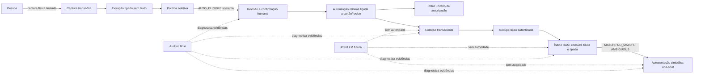

# Grand Finale da coleção — composição multi-cartão, abstenção e autoridade humana

**Passo 6 pré-hardware · HERUS-M14-001 · composição host, não armazenamento físico nem autonomia**

> Uma coleção autenticada, um índice limitado e uma interface simbólica não se tornam uma memória pessoal segura apenas por coexistirem. A cadeia precisa demonstrar, em ordem, que o consentimento humano antecede a admissão, que a recuperação observa somente um estado transacional aceito, que a incerteza termina sem vencedor e que nenhum modelo, fallback ou índice recebe autoridade nova.

Este passo fecha a integração que `docs/24-GRAND-FINALE-MEMORIA.md` havia deixado deliberadamente pendente: a passagem explícita da autorização humana de memória para a coleção multi-cartão e para seu índice privado. Ele introduz `memory_collection_finale.[ch]` e `test_memory_collection_finale.c`, um auditor C11 puro e uma fixture host que percorre módulos reais de captura, extração, política, consolidação, cofre de autorização, coleção, recuperação, índice e apresentação.

A motivação é engenharia de sistemas, não uma nova função de produto. O Passo 7 posterior acrescenta `collection_physical_session_bound` como evidência exigida: a fixture usa sessão `INSERT` separada para admissão e sessão `QUERY` separada para recuperação; o auditor não emite, renova ou prova esse evento. O NIST SP 800-160 recomenda que requisitos, arquitetura, integração, verificação e validação participem da engenharia de sistemas confiáveis ao longo do ciclo [1]. O princípio de menor privilégio do NIST restringe permissões ao mínimo necessário para cada usuário ou processo [2]. Por isso, o novo auditor recebe somente evidências agregadas e enums fechados: ele não recebe cartão, ID opaco, consulta, sessão, coleção, índice, cofre, chave, texto, áudio, transcrição, embedding, identidade, localização, saída de modelo ou callback.

| Artefato | Responsabilidade | Limite deliberado |
|---|---|---|
| `memory_collection_finale.h` | Define um snapshot compacto de evidência da cadeia humana, transacional, de recuperação e apresentação. | Não representa dados de produto, objetos vivos ou autoridade. |
| `memory_collection_finale.c` | Classifica o snapshot de forma determinística e fail-closed. | Não insere, abre, lista, remove, compacta, consulta, apresenta, envia, persiste, registra ou chama modelo. |
| `test_memory_collection_finale.c` | Executa a fixture M14 e falsifica transições de autoridade e abstinência. | Backend RAM apenas; não é NVS, elemento seguro, ASR, interface física ou estudo de pessoas. |
| `make memory-collection-finale` | Compila a composição sob C11 estrito. | Não mede escala, energia, latência, privacidade de acesso, UX ou hardware. |
| `threat_model.[ch]` | Exige `memory_collection_composed` para TM-04 permanecer `MITIGATED_HOST`. | Não classifica hardware, probabilidade de risco ou segurança de release. |

## 1. Cadeia explícita, sem fallback implícito

A cadeia deixa de sugerir que o cofre unitário e a coleção são intercambiáveis. A confirmação de consolidação cria a autorização mínima já existente; a fixture deriva o cartão mínimo correspondente, faz a admissão separada na coleção e recupera somente por índice. O caminho de consulta não chama `memory_collection_open`; um `MATCH` continua sendo apenas um estado mínimo que pode justificar uma **operação futura, separada e fisicamente confirmada** de abertura. A condição `unit_vault_fallback_used` do auditor é uma evidência negativa: fallback de recuperação ao cofre unitário torna a composição inconsistente.



O diagrama não indica que o cofre unitário seja usado como fallback de recuperação. Ele permanece o contrato já existente para emitir e validar a autorização mínima no host; a coleção é uma persistência lógica separada, limitada e transacional. Não há migração silenciosa, deduplicação semântica, enumeração, abertura automática ou escolha de card pelo auditor.

| Fronteira | Evidência que M14 exige | Falha se estiver ausente ou contraditória |
|---|---|---|
| Entrada humana | Captura física canônica, extração tipada, `AUTO_ELIGIBLE`, revisão e autorização de escrita vinculada. | Captura, extração, política, revisão ou autorização. |
| Admissão de coleção | Inserção autorizada, sessão `INSERT` vinculada, estado `READY`, recuperação consistente e registro autenticado. | Inserção, sessão, estado, recuperação ou autenticidade. |
| Consulta privada | Sessão `QUERY` vinculada, query tipada, orçamento respeitado e status fechado. | Sessão/acesso, query, orçamento ou status. |
| Sem escolha automática | Nenhuma abertura do cartão pelo resultado do índice e nenhum fallback de recuperação unitária. | `FAIL_AUTO_OPEN` ou `FAIL_LEGACY_FALLBACK`. |
| Saída para pessoa | Acesso físico, one-shot e contrato canônico de apresentação. | Falha de acesso, repetição ou contrato. |
| Modelo | Ausência canônica de modelo em todo o caminho. | `FAIL_MODEL_AGENCY`. |

## 2. Estados de recuperação permanecem abstencionistas

`MATCH`, `NO_MATCH` e `AMBIGUOUS` são os únicos estados de índice aceitos pelo auditor. O êxito do auditor não afirma que uma pessoa recuperou uma informação; ele afirma somente que, no snapshot exercitado, a cadeia não inventou um vencedor, não abriu cartão automaticamente e não transferiu autoridade para modelo. `NO_MATCH` e `AMBIGUOUS` são resultados terminais coerentes, com apresentação simbólica sem contender.

| Resultado do índice | O que a fixture prova | O que continua proibido |
|---|---|---|
| `MATCH` | A query física e tipada retorna estado mínimo; a apresentação não mostra ID opaco nem conteúdo. | Abrir cartão, listar coleção, armazenar consulta, enviar, escolher nova ação ou permitir modelo decidir. |
| `NO_MATCH` | Não expõe ID, razões ou propriedade de cartão; chega somente a status simbólico. | Repetir busca sem sessão nova, ampliar consulta silenciosamente, cair no cofre unitário ou inferir ausência de memória pessoal. |
| `AMBIGUOUS` | É consistente como incerteza e não recebe winner. | Desempatar automaticamente, apresentar contender, abrir card ou tratar a incerteza como falha permissiva. |

Essa retenção mínima também é coerente com o objetivo do NIST Privacy Framework de identificar e gerir riscos de privacidade relacionados ao processamento de dados [3]. O snapshot M14 não adiciona logs de áudio, transcrição, embedding, identidade, localização, chave, cartão, query, resultado de índice ou evidência transitória de sessão física.

## 3. Cenário exercitado e contraprovas

A fixture usa RAM somente para tornar os contratos exercitáveis em host. Ela começa em captura física limitada, extrai um sinal tipado de ideia própria/ordinária, exige `AUTO_ELIGIBLE`, cria revisão e confirmação da mesma sessão, obtém a autorização mínima, insere cartão na coleção, reabre a coleção para aceitar sua topologia autenticada, consulta pelo índice e apresenta estado local one-shot. O contador de `opens` permanece inalterado durante o `MATCH`.

| Contraprova M14 | Resultado obrigatório |
|---|---|
| Política em `REVIEW` ou revisão humana ausente | Cadeia bloqueia; elegibilidade não vira retenção. |
| Coleção `BLOCKED`, recuperação ausente ou autenticação ausente | Cadeia bloqueia antes de recuperação. |
| Orçamento de consulta ausente | Cadeia bloqueia; não há sondagem ilimitada. |
| Resultado que abre cartão automaticamente | `FAIL_AUTO_OPEN`; índice não recebe autoridade de abertura. |
| Fallback de recuperação para cofre unitário | `FAIL_LEGACY_FALLBACK`; não há caminho implícito paralelo. |
| Modelo no caminho | `FAIL_MODEL_AGENCY`; modelo não escolhe, grava, recupera ou apresenta. |
| Sessão de coleção ausente/não canônica, apresentação inválida ou enum de status desconhecido | Falha fechada; estado parcial não herda sucesso. |

A prova T9 do modelo de ameaças remove isoladamente `memory_collection_composed` ou `memory_physical_session_bound` e mostra que TM-04 deixa de ser classificada como `MITIGATED_HOST`, mesmo com os demais controles presentes. Isso impede que a integração seja apenas uma página de arquitetura. Os Passos 8 e 9 acrescentam recuperação de reserva e quarentena de boot; o [Gran Finale pré-hardware](34-GRAN-FINALE-PRE-HARDWARE.md) consome o veredito M14 junto a essa quarentena e TM-04, sem adicionar circularmente uma evidência a TM-04. O NIST AI RMF e seu perfil de IA generativa tratam a definição de papéis, responsabilidades e supervisão humano-IA como parte da gestão de risco; o HERUS traduz isso em ausência estrutural de autoridade de modelo, não em alegação de alinhamento ou qualidade de LLM [4].

## 4. Fronteiras que continuam pendentes

A composição M14 é mais profunda porque conecta os módulos reais e força suas recusas a dominarem a cadeia; ela ainda é evidência de host. Nenhuma afirmação abaixo é permitida sem um adaptador e uma medição/avaliação específica do alvo escolhido.

| Lacuna | Evidência futura mínima | Afirmar agora seria incorreto porque |
|---|---|---|
| Backend persistente | Semântica de sucesso, raiz, piso, corte controlado, rollback e recuperação no armazenamento selecionado. | A fixture RAM não demonstra NVS, flash, FRAM, secure element, wear, atomicidade ou power-loss. |
| Sessão física | Adaptador com origem de evento, nonce, tempo monotônico, piso/estratégia pós-reboot, falhas/cancelamento e avaliação. | Propósito/consumo C11 em RAM não provam botão, toque, biometria, pessoa, entropia ou replay pós-reboot. |
| Apresentação humana | Driver, UX acessível, protocolo pré-registrado e resultados observados. | Status simbólico não prova voz, vibração, tela, compreensão ou acessibilidade. |
| Privacidade de consulta | Modelo de adversário, memória protegida, análise de padrão de acesso e mecanismo adequado. | Limite por sessão e RAM transitória não são PIR, ORAM ou resistência a side-channel. |
| Inteligência local | Pesos identificados, perfil no alvo, avaliação, limites de recurso e fronteira de ataque. | M14 apenas impede autoridade; não mede entendimento, relevância, ASR ou LLM. |
| Plataforma aberta | Critérios aplicados a qualquer MCU, coprocessador, secure element, FRAM ou backend possível. | O contrato não escolhe nem aprova fornecedor, arquitetura ou silício. |

## 5. Reprodução

```bash
cd firmware
make memory-collection-finale
make memory-physical-session
make memory-physical-session-bootstrap
make memory-prehardware-finale
make threat-model
cd ..
git diff --check
./prove.sh --quiet
```

Com os passos posteriores, o pipeline executa **35 suítes**, **79 invariantes de prova** e mantém **74 invariantes do sistema simulado**. Um resultado positivo prova os cenários C11 descritos e a recusa das contraprovas exercitadas. Não prova durabilidade física, autonomia, utilidade pessoal, memória humana, relevância, escala, latência, energia, segurança de rádio, ASR, LLM, UI, acessibilidade, privacidade de padrão de acesso ou qualquer propriedade de hardware.

## Referências

[1] National Institute of Standards and Technology, *SP 800-160 Vol. 1 Update 2: Engineering Trustworthy Secure Systems*. [Publicação oficial](https://csrc.nist.gov/pubs/sp/800-160/v1/upd2/final).

[2] National Institute of Standards and Technology, *Least Privilege*. [Glossário oficial](https://csrc.nist.gov/glossary/term/least_privilege).

[3] National Institute of Standards and Technology, *Privacy Framework*. [Página oficial](https://www.nist.gov/privacy-framework).

[4] National Institute of Standards and Technology, *AI Risk Management Framework* e *AI 600-1: Generative AI Profile*. [AI RMF](https://www.nist.gov/itl/ai-risk-management-framework) e [publicação oficial](https://nvlpubs.nist.gov/nistpubs/ai/NIST.AI.600-1.pdf).
